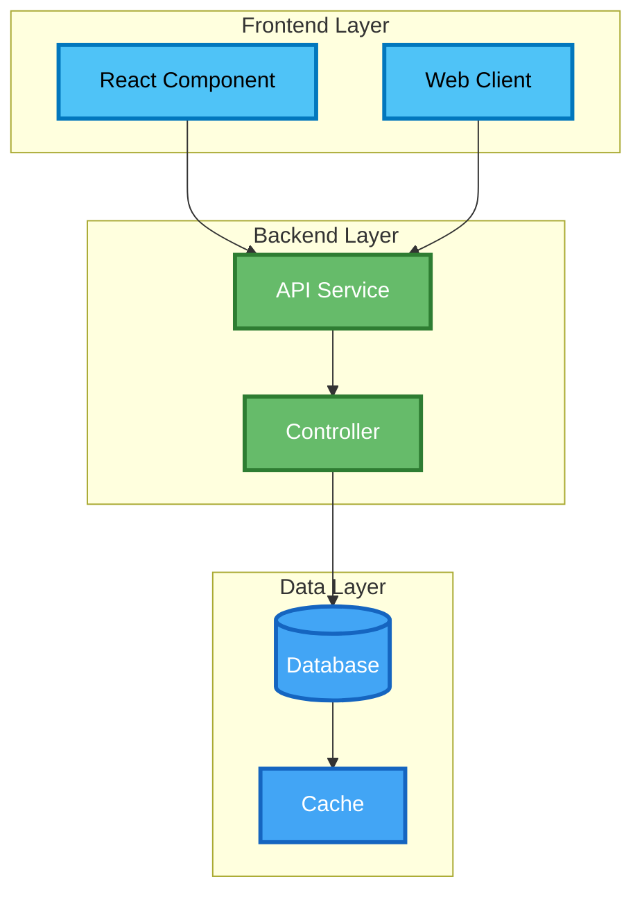

# Simple Independent Blog Framework

## Overview

This document outlines a streamlined framework for organizing blog content as **independent, shareable posts** that can cover any technical topic while maintaining professional presentation and easy discovery. The framework prioritizes content flexibility over complex project dependencies.

## Core Philosophy

- **Independent Posts**: Each post stands alone and can be shared without context
- **Content-Focused**: Posts about any technical topic, not tied to specific projects
- **Minimal Metadata**: Simple frontmatter for easy management
- **Professional Presentation**: Showcase technical expertise and learning
- **Easy Discovery**: Clear categorization and tagging for content discovery
- **Flexible Content Types**: Support any type of technical content

## Content Types

### Primary Content Types

```yaml
content_types:
  - "architecture-analysis"     # System design, architectural decisions, patterns
  - "feature-development"       # New functionality, improvements, iterations
  - "service-documentation"     # Specific service details, API design, implementation
  - "infrastructure-design"     # Cloud architecture, deployment, DevOps
  - "troubleshooting"           # Problem-solving, debugging, issue resolution
  - "lessons-learned"           # Retrospectives, insights, learning outcomes
  - "technology-comparison"     # Framework/tool comparisons, evaluations
  - "performance-optimization"  # Performance analysis, optimization techniques
  - "security-implementation"   # Security architecture, best practices
  - "deployment-strategy"       # CI/CD, environment management, rollback
  - "code-review"              # Code analysis, best practices, refactoring
  - "tutorial"                 # Step-by-step guides, how-to content
  - "requirements"             # Requirements analysis, specifications, acceptance criteria
  - "opinion"                  # Technical opinions, industry thoughts
  - "research"                 # Technical research, findings, experiments
  - "book-review"              # Technical book reviews, summaries
  - "conference-notes"         # Conference talks, event summaries
  - "interview-notes"          # Technical interviews, Q&A sessions
```

### Content Type Examples

#### Architecture Analysis
- "Microservices vs Monolith: When to Choose What"
- "API Design Patterns and Best Practices"
- "Database Architecture for Scalable Applications"
- "Event-Driven Architecture: Benefits and Trade-offs"

#### Feature Development
- "Building Real-time Notifications with WebSockets"
- "Implementing Advanced Search with Elasticsearch"
- "Creating Responsive Dashboards with React"
- "Adding Authentication to Your Web App"

#### Service Documentation
- "User Service: Complete API Documentation"
- "Payment Processing Service Architecture"
- "Notification Service Implementation Guide"
- "Analytics Service: Data Pipeline Design"

#### Infrastructure Design
- "AWS Architecture for High-Availability Applications"
- "Docker Containerization Best Practices"
- "Kubernetes Deployment Strategies"
- "CI/CD Pipeline Design and Implementation"

#### Troubleshooting
- "Debugging Memory Leaks in Node.js Applications"
- "Database Performance Issues: Common Causes and Solutions"
- "API Rate Limiting: Implementation and Troubleshooting"
- "Docker Container Debugging Techniques"

#### Lessons Learned
- "What I Learned Building a Microservices Architecture"
- "5 Years of React: Lessons and Best Practices"
- "Database Migration Strategies: What Works and What Doesn't"
- "Code Review Best Practices from 100+ Reviews"

#### Requirements
- "API Requirements Specification: User Authentication Service"
- "System Requirements Analysis: High-Availability E-commerce Platform"
- "Functional Requirements: Real-time Chat Application"
- "Non-Functional Requirements: Performance and Security Specifications"

## Frontmatter Schema

### Standard Frontmatter

```yaml
---
# Standard Jekyll metadata
title: "Post Title"
date: 2025-10-01
categories: [Learning, Architecture, System-Design]
tags: [microservices, architecture, system-design, api-design]

# Optional: Content context
content_type: "architecture-analysis"  # Optional: type of content
learning_focus: ["microservices", "api-design"]  # Optional: key learning areas
difficulty: "intermediate"  # Optional: beginner, intermediate, advanced
reading_time: "8 min read"  # Optional: estimated reading time
---
```

### Frontmatter Fields Explained

- **title**: Clear, descriptive post title
- **date**: Publication date
- **categories**: Primary content categories (Learning, Architecture, Development, etc.)
- **tags**: Specific topics and technologies covered
- **content_type**: Type of content (from content types list)
- **learning_focus**: Key learning areas covered in the post
- **difficulty**: Target audience skill level
- **reading_time**: Estimated reading time (optional)

## Content Structure

### Standard Post Structure

```markdown
# Post Title

Brief introduction to the topic and what readers will learn.

## Main Content Sections

### Section 1: Overview/Introduction
[Context and background]

### Section 2: Core Content
[Main technical content, examples, code]

### Section 3: Implementation/Examples
[Practical examples, code snippets]

### Section 4: Key Takeaways
[Summary of main points]

## Conclusion

Final thoughts and next steps.

---

<!-- Post navigation is handled by the theme's built-in pagination -->
```

### Automatic Post Navigation

The framework includes automatic previous/next post navigation based on publication date:

- **Previous Post**: Automatically links to the chronologically previous post
- **Next Post**: Automatically links to the chronologically next post
- **Responsive Design**: Works on both desktop and mobile
- **Clean Styling**: Professional appearance with hover effects
- **Smart Display**: Only shows navigation when previous/next posts exist

### Content Templates

#### Architecture Analysis Post Template

```markdown
---
title: "[Topic]: [Architecture Aspect] Analysis"
date: 2025-10-01
categories: [Learning, Architecture, System-Design]
tags: [architecture, system-design, microservices]
content_type: "architecture-analysis"
learning_focus: ["microservices", "api-design", "system-architecture"]
difficulty: "intermediate"
---

# [Topic]: [Architecture Aspect] Analysis

## Overview
[Brief introduction to the architecture topic]

## Architecture Overview
[High-level system diagrams, component relationships, data flow]

## Design Decisions
[Key architectural decisions, rationale, trade-offs]

## Implementation Details
[Technical implementation, patterns used, best practices]

## Integration Points
[How this architecture integrates with other systems]

## Key Takeaways
[Summary of main architectural insights]

## Conclusion
[Final thoughts and recommendations]
```

#### Tutorial Post Template

```markdown
---
title: "How to [Do Something]: Step-by-Step Guide"
date: 2025-10-01
categories: [Learning, Tutorial, Development]
tags: [tutorial, how-to, step-by-step]
content_type: "tutorial"
learning_focus: ["practical-skills", "implementation"]
difficulty: "beginner"
---

# How to [Do Something]: Step-by-Step Guide

## Prerequisites
[What readers need to know before starting]

## Step 1: [First Step]
[Detailed instructions with code examples]

## Step 2: [Second Step]
[Detailed instructions with code examples]

## Step 3: [Third Step]
[Detailed instructions with code examples]

## Testing and Validation
[How to verify the implementation works]

## Troubleshooting
[Common issues and solutions]

## Next Steps
[What to do after completing the tutorial]
```

#### Troubleshooting Post Template

```markdown
---
title: "Troubleshooting [Specific Issue]: Common Causes and Solutions"
date: 2025-10-01
categories: [Learning, Troubleshooting, Development]
tags: [troubleshooting, debugging, problem-solving]
content_type: "troubleshooting"
learning_focus: ["debugging", "problem-solving"]
difficulty: "intermediate"
---

# Troubleshooting [Specific Issue]: Common Causes and Solutions

## Problem Description
[Clear description of the issue]

## Common Causes
[Most frequent causes of this issue]

## Solution 1: [First Solution]
[Step-by-step solution with code examples]

## Solution 2: [Second Solution]
[Alternative approach if first doesn't work]

## Prevention
[How to avoid this issue in the future]

## Key Takeaways
[Summary of debugging insights]
```

#### Requirements Post Template

```markdown
---
title: "[System/Feature]: Requirements and Objectives"
date: 2025-10-01
categories: [Learning, Requirements, Analysis]
tags: [requirements, objectives, user-stories]
content_type: "requirements"
learning_focus: ["requirements-analysis", "project-planning"]
difficulty: "intermediate"
---

# [System/Feature]: Requirements and Objectives

## What We Plan to Create
[Brief description of the system or feature]

## Objectives
[Key goals and what we want to achieve]

## User Stories
[Specific user scenarios and what users need to accomplish]

## Key Takeaways
[Summary of requirements insights]
```

## Projects Page Structure

### Content-Focused Projects Page

```markdown
---
title: "Technical Content"
permalink: /projects/
---

# Technical Content

Welcome to my collection of technical content covering architecture, development, and learning insights.

## Recent Posts

### Architecture & System-Design
- [Microservices vs Monolith: When to Choose What →](/learning/architecture/microservices-vs-monolith/) *(Architecture)*
- [API Design Patterns and Best Practices →](/learning/architecture/api-design-patterns/) *(Architecture)*
- [Database Architecture for Scalable Applications →](/learning/architecture/database-architecture/) *(Architecture)*

### Development & Implementation
- [Building Real-time Notifications with WebSockets →](/learning/development/realtime-notifications/) *(Feature)*
- [Implementing Advanced Search with Elasticsearch →](/learning/development/elasticsearch-search/) *(Feature)*
- [Creating Responsive Dashboards with React →](/learning/development/react-dashboards/) *(Feature)*

### Infrastructure & DevOps
- [AWS Architecture for High-Availability Applications →](/learning/infrastructure/aws-ha-architecture/) *(Infrastructure)*
- [Docker Containerization Best Practices →](/learning/infrastructure/docker-best-practices/) *(Infrastructure)*
- [Kubernetes Deployment Strategies →](/learning/infrastructure/kubernetes-deployment/) *(Infrastructure)*

### Learning & Insights
- [What I Learned Building a Microservices Architecture →](/learning/insights/microservices-lessons/) *(Lessons)*
- [5 Years of React: Lessons and Best Practices →](/learning/insights/react-lessons/) *(Lessons)*
- [Code Review Best Practices from 100+ Reviews →](/learning/insights/code-review-best-practices/) *(Lessons)*

## Content by Type

### Architecture Analysis
Deep dives into system design, architectural decisions, and design patterns.

### Feature Development
Implementation guides, new functionality, and development techniques.

### Infrastructure Design
Cloud architecture, deployment strategies, and DevOps practices.

### Learning & Insights
Lessons learned, retrospectives, and professional development content.

### Tutorials & Guides
Step-by-step guides and how-to content for practical implementation.

### Troubleshooting
Problem-solving guides and debugging techniques.

## Content Focus Areas

- **System Architecture**: Microservices, monoliths, distributed systems
- **API Design**: REST, GraphQL, API best practices
- **Database Design**: Data modeling, performance, scalability
- **Frontend Development**: React, Vue, Angular, modern web development
- **Backend Development**: Node.js, Python, Java, server-side architecture
- **Cloud & Infrastructure**: AWS, Azure, GCP, containerization
- **DevOps & CI/CD**: Deployment, monitoring, automation
- **Security**: Authentication, authorization, security best practices
- **Performance**: Optimization, monitoring, scalability
- **Learning**: Professional development, career insights, industry trends

## 📈 Content Statistics

- **Total Posts**: [Number]
- **Architecture Posts**: [Number]
- **Development Posts**: [Number]
- **Infrastructure Posts**: [Number]
- **Learning Posts**: [Number]
- **Tutorial Posts**: [Number]

*Interested in collaborating or discussing any of these topics? [Get in touch!](/about/)*
```

## Content Creation Guidelines

### Post Creation Checklist

When creating a new post, ensure you:

#### 1. **Frontmatter Setup**
- [ ] Set clear, descriptive title
- [ ] Add appropriate categories
- [ ] Include relevant tags
- [ ] Set content_type if applicable
- [ ] Add learning_focus if applicable
- [ ] Set difficulty level if applicable

#### 2. **Content Structure**
- [ ] Write clear introduction
- [ ] Organize content into logical sections
- [ ] Include code examples where relevant
- [ ] Add diagrams or visual aids if helpful
- [ ] Write clear conclusion with key takeaways
- [ ] Include related links if applicable

#### 3. **Content Quality**
- [ ] Proofread for grammar and clarity
- [ ] Ensure technical accuracy
- [ ] Test code examples if included
- [ ] Verify all links work correctly
- [ ] Check that post stands alone (no external dependencies)

#### 4. **Discovery & SEO**
- [ ] Use descriptive, searchable title
- [ ] Include relevant keywords in content
- [ ] Add appropriate tags for discovery
- [ ] Ensure good internal linking
- [ ] Write compelling meta description

#### 5. **Professional Presentation**
- [ ] Use consistent formatting
- [ ] Include code syntax highlighting
- [ ] Add visual elements where helpful
- [ ] Ensure mobile-friendly formatting
- [ ] Check reading flow and structure

### Content Type Guidelines

#### Architecture Analysis Posts
- Focus on design decisions and trade-offs
- Include system diagrams and visual aids
- Explain rationale behind architectural choices
- Discuss scalability and maintainability implications
- Provide real-world examples and case studies

#### Feature Development Posts
- Include step-by-step implementation details
- Provide working code examples
- Explain the problem being solved
- Discuss alternative approaches
- Include testing and validation steps

#### Tutorial Posts
- Start with clear prerequisites
- Break down complex tasks into manageable steps
- Include code examples for each step
- Provide troubleshooting guidance
- End with next steps and further learning

#### Troubleshooting Posts
- Clearly describe the problem
- Explain common causes
- Provide multiple solution approaches
- Include prevention strategies
- Share debugging techniques and tools

#### Lessons Learned Posts
- Reflect on real experiences
- Share both successes and failures
- Provide actionable insights
- Include specific examples and stories
- Connect to broader industry trends

#### Requirements Posts
- Clearly describe what you plan to create
- Define clear objectives and goals
- Include specific user stories with acceptance criteria
- Use simple, clear language
- Focus on user needs and outcomes

## Mermaid Diagram Guidelines

### Color Palette for Diagrams



### Diagram Usage Guidelines
- Use consistent color coding for component types
- Include clear labels and relationships
- Keep diagrams simple and focused
- Use subgraphs to group related components
- Always include a legend or explanation

## Content Maintenance

### Regular Updates
- **Content Review**: Periodically review older posts for accuracy
- **Link Checking**: Verify all external links still work
- **Tag Consistency**: Ensure tags are used consistently across posts
- **Category Organization**: Review and update categories as needed

### Content Quality
- **Technical Accuracy**: Keep technical content current and accurate
- **Code Examples**: Test and update code examples regularly
- **Visual Elements**: Ensure diagrams and images are clear and helpful
- **Reading Experience**: Maintain consistent formatting and structure

## Benefits of This Approach

### For Content Creation
- **Complete Freedom**: Write about any technical topic
- **No Dependencies**: Posts don't need to relate to specific projects
- **Easy Management**: Simple metadata and structure
- **Flexible Content**: Support any type of technical content
- **Professional Presentation**: Showcase expertise across domains

### For Audience
- **Easy Discovery**: Clear categorization and tagging
- **Independent Reading**: Each post stands alone
- **Diverse Content**: Wide range of technical topics
- **Professional Quality**: Consistent, high-quality content
- **Easy Sharing**: Posts can be shared without context

### For SEO and Discovery
- **Rich Content**: Diverse topics increase search visibility
- **Clear Structure**: Consistent formatting improves readability
- **Internal Linking**: Strategic linking between related posts
- **Topic Clusters**: Related content grouped by categories
- **Long-form Content**: Detailed posts perform better in search

## Future Enhancements

### Advanced Features
- **Content Filtering**: Filter by content type, difficulty, or topic
- **Reading Time**: Automatic reading time calculation
- **Related Content**: Automatic suggestions for related posts
- **Content Analytics**: Track popular content and engagement
- **Search Functionality**: Enhanced search across all content

### Content Expansion
- **Video Content**: Add video tutorials and explanations
- **Interactive Examples**: Include interactive code examples
- **Community Features**: Comments and discussion on posts
- **Newsletter**: Regular updates on new content
- **Content Series**: Multi-part content on complex topics

## Quick Reference

### Content Type Quick Guide
- **Architecture Analysis**: System design, architectural decisions, patterns
- **Feature Development**: New functionality, improvements, implementation
- **Service Documentation**: Specific service details, API design
- **Infrastructure Design**: Cloud architecture, deployment, DevOps
- **Troubleshooting**: Problem-solving, debugging, issue resolution
- **Lessons Learned**: Retrospectives, insights, learning outcomes
- **Technology Comparison**: Framework/tool comparisons, evaluations
- **Performance Optimization**: Performance analysis, optimization techniques
- **Security Implementation**: Security architecture, best practices
- **Deployment Strategy**: CI/CD, environment management, rollback
- **Code Review**: Code analysis, best practices, refactoring
- **Tutorial**: Step-by-step guides, how-to content
- **Requirements**: Requirements analysis, specifications, acceptance criteria
- **Opinion**: Technical opinions, industry thoughts
- **Research**: Technical research, findings, experiments

### Post Creation Checklist
- [ ] Clear, descriptive title
- [ ] Appropriate categories and tags
- [ ] Well-structured content
- [ ] Code examples if relevant
- [ ] Visual aids if helpful
- [ ] Clear conclusion
- [ ] Professional presentation
- [ ] Mobile-friendly formatting
- [ ] Working links
- [ ] Standalone content

This framework provides a comprehensive foundation for creating independent, professional technical content while maintaining flexibility and ease of management.
