This project demonstrates **systematic architectural evolution**, showing how the same domain can be approached through different technology stacks and architectural patterns. Each evolution builds upon the previous, creating a comprehensive case study in architectural decision-making and technology learning.

## Evolution Journey Diagram

## Project Overview

The Tenant Management project started as a simple single-file application and has evolved through multiple architectural approaches, each representing different learning objectives and technology mastery goals.

**Current Status**: Evolution 6 - Cloud Deployment Strategies (Complete) ✅  
**Total Posts**: 11 posts across 6 evolutions  
**Technologies**: Python, Flask, FastAPI, React, Java, Spring Boot, Docker, MCP, LLM APIs, NLP, AWS, Terraform, ECS, Elastic Beanstalk

## Technical Architecture Evolution

```mermaid
graph TB
    subgraph "Evolution 1: Single-File Foundation"
        A1[Single Python File<br/>Flask + SQLAlchemy<br/>Embedded Templates]
    end
    
    subgraph "Evolution 2: Modular Architecture"
        A2[Modular Monolith<br/>Service Layer Pattern<br/>React Frontend + Python API]
    end
    
    subgraph "Evolution 3: Java Enterprise Stack"
        A3[Spring Boot Application<br/>Layered Architecture<br/>Docker Containerization]
    end
    
    subgraph "Evolution 4: AI-Enhanced Interface"
        A4[AI Integration Layer<br/>LLM APIs + MCP<br/>✅ Complete]
    end
    
    subgraph "Evolution 5: Conversational Interface"
        A5[Conversational Layer<br/>NLP + Chat Interface<br/>✅ Complete]
    end
    
    subgraph "Evolution 6: Cloud Deployment"
        A6[Cloud Infrastructure<br/>AWS Multi-Approach<br/>✅ Complete]
    end
    
    A1 -->|Refactoring| A2
    A2 -->|Technology Migration| A3
    A3 -->|AI Integration| A4
    A4 -->|Conversational UX| A5
    A5 -->|Cloud Deployment| A6
    
    %% Styling
    classDef completed fill:#4caf50,stroke:#2e7d32,stroke-width:3px,color:#fff
    classDef active fill:#2196f3,stroke:#1565c0,stroke-width:3px,color:#fff
    classDef planned fill:#9e9e9e,stroke:#616161,stroke-width:3px,color:#fff
    
    class A1,A2,A3,A4,A5,A6 completed
```

## Evolution Timeline




### Evolution {{ evo.number }}: {{ evo.title }}
**Status**: 
✅ Complete
🔄 Active
📋 Planned
**Focus**: {{ evo.focus }}  
**Technologies**: {{ evo.technologies | join: ", " }}

[View Evolution {{ evo.number }} Details]({{ evo.url }})


## Quick Navigation

- [All Posts in Chronological Order](/projects/tenant-management/posts/)

- [Evolution {{ evo.number }}: {{ evo.title }}]({{ evo.url }})


## Learning Journey

This evolutionary approach demonstrates:

1. **Progressive Complexity**: Each evolution builds upon previous learnings
2. **Technology Mastery**: Deep dive into different technology stacks
3. **Architectural Patterns**: From simple to enterprise-ready architectures
4. **Decision Making**: Documented reasoning behind each architectural choice
5. **Portfolio Value**: Comprehensive case study in software evolution

## Key Learnings

- **Rapid Prototyping**: Evolution 1 taught the importance of getting something working quickly
- **Clean Architecture**: Evolution 2 emphasized separation of concerns and modularity
- **Enterprise Patterns**: Evolution 3 introduced Spring Boot, containerization, and production-ready practices
- **AI Integration**: Evolution 4 explores modern AI/ML integration patterns with MCP protocol
- **Conversational UX**: Evolution 5 focused on natural language interfaces
- **Cloud Deployment**: Evolution 6 explored 5 different AWS deployment strategies

## Project Philosophy

This project represents a **learning-first approach** to software development, where each evolution serves both practical and educational purposes. By documenting the journey, it becomes a valuable resource for understanding architectural evolution and technology decision-making.

---

*This project is part of my ongoing learning journey in software architecture and full-stack development. Each evolution represents a deliberate step toward mastering different aspects of modern software development.*
