This project demonstrates **systematic architectural evolution**, showing how the same domain can be approached through different technology stacks and architectural patterns. Each evolution builds upon the previous, creating a comprehensive case study in architectural decision-making and technology learning.

## Evolution Journey Diagram

## Project Overview

The Tenant Management project started as a simple single-file application and has evolved through multiple architectural approaches, each representing different learning objectives and technology mastery goals.

**Current Status**: Evolution 5 - AI Conversational Interface (Active)  
**Total Posts**: 10 posts across 5 evolutions  
**Technologies**: Python, Flask, FastAPI, React, Java, Spring Boot, Docker, MCP, LLM APIs, NLP

## Technical Architecture Evolution

```mermaid
graph TB
    subgraph "Evolution 1: Single-File Foundation"
        A1[Single Python File<br/>Flask + SQLAlchemy<br/>Embedded Templates]
    end
    
    subgraph "Evolution 2: Modular Architecture"
        A2[Modular Monolith<br/>Service Layer Pattern<br/>React Frontend + Python API]
    end
    
    subgraph "Evolution 3: Java Enterprise Stack"
        A3[Spring Boot Application<br/>Layered Architecture<br/>Docker Containerization]
    end
    
    subgraph "Evolution 4: AI-Enhanced Interface"
        A4[AI Integration Layer<br/>LLM APIs + MCP<br/>✅ Complete]
    end
    
    subgraph "Evolution 5: Conversational Interface"
        A5[Conversational Layer<br/>NLP + Chat Interface<br/>🔄 Active]
    end
    
    A1 -->|Refactoring| A2
    A2 -->|Technology Migration| A3
    A3 -->|AI Integration| A4
    A4 -->|Conversational UX| A5
    
    %% Styling
    classDef completed fill:#4caf50,stroke:#2e7d32,stroke-width:3px,color:#fff
    classDef active fill:#2196f3,stroke:#1565c0,stroke-width:3px,color:#fff
    classDef planned fill:#9e9e9e,stroke:#616161,stroke-width:3px,color:#fff
    
    class A1,A2,A3 completed
    class A1,A2,A3,A4 completed
    class A5 active
```

## Evolution Timeline

### Evolution 1: Single-File Foundation
**Status**: ✅ Complete  
**Posts**: 1 post  
**Focus**: Rapid prototyping and learning fundamentals  
**Technologies**: Python, Flask, SQLAlchemy

- [Building a Full-Stack Property Management App: Single File Version](/learning/full-stack-development/python/tenant-management-app-singlefile/)

### Evolution 2: Modular Architecture
**Status**: ✅ Complete  
**Posts**: 2 posts  
**Focus**: Clean architecture and separation of concerns  
**Technologies**: Python, Flask, FastAPI, React

- [From Single-File to Modular Monolith: Refactoring the Tenant Management App](/learning/architecture/refactoring/tenant-management-modular-monolith/)
- [Tenant Management System: Modular Monolith Architecture](/learning/architecture/system-design/tenant-management-system-architecture/)

### Evolution 3: Java Enterprise Stack
**Status**: ✅ Complete  
**Posts**: 3 posts  
**Focus**: Enterprise patterns and Spring Boot migration  
**Technologies**: Java, Spring Boot, React, Docker, PostgreSQL

- [Tenant Management App: Spring Boot and React Transition](/learning/development/java/tenant-management-java-transition/)
- [Tenant Management Java Stack: System Architecture](/learning/architecture/system-design/tenant-management-java-architecture/)
- [Tenant Management App Demo (WebUI)](/learning/development/demo/tenant-management-app-demo-webui/)

### Evolution 4: AI-Enhanced Interface
**Status**: ✅ Complete  
**Posts**: 2 posts  
**Focus**: LLM integration and MCP support  
**Technologies**: AI/ML, LLM APIs, MCP, Python, Enhanced UX

- [Tenant Management API to MCP Conversion: Bridging Enterprise Apps with AI](/learning/development/ai-integration/tenant-management-api-mcp-conversion/)
- [Unlocking Unlimited Possibilities: AI-Powered On-Demand Insights with Tenant Management MCP](/learning/development/ai-integration/tenant-management-mcp-ai-powered-insights/)

### Evolution 5: Conversational Interface
**Status**: 🔄 Active  
**Posts**: 1 post  
**Focus**: Chat-based interaction and natural language processing  
**Technologies**: Chat interfaces, NLP, Conversational AI

## Quick Navigation

- [All Posts in Chronological Order](/projects/tenant-management/posts/)
- [Evolution 1: Single-File Foundation](/projects/tenant-management/evolution-1/)
- [Evolution 2: Modular Architecture](/projects/tenant-management/evolution-2/)
- [Evolution 3: Java Enterprise Stack](/projects/tenant-management/evolution-3/)
- [Evolution 4: AI-Enhanced Interface](/projects/tenant-management/evolution-4/)
- [Evolution 5: Conversational Interface](/projects/tenant-management/evolution-5/)

## Learning Journey

This evolutionary approach demonstrates:

1. **Progressive Complexity**: Each evolution builds upon previous learnings
2. **Technology Mastery**: Deep dive into different technology stacks
3. **Architectural Patterns**: From simple to enterprise-ready architectures
4. **Decision Making**: Documented reasoning behind each architectural choice
5. **Portfolio Value**: Comprehensive case study in software evolution

## Key Learnings

- **Rapid Prototyping**: Evolution 1 taught the importance of getting something working quickly
- **Clean Architecture**: Evolution 2 emphasized separation of concerns and modularity
- **Enterprise Patterns**: Evolution 3 introduced Spring Boot, containerization, and production-ready practices
- **AI Integration**: Evolution 4 explores modern AI/ML integration patterns with MCP protocol
- **Conversational UX**: Evolution 5 will focus on natural language interfaces

## Project Philosophy

This project represents a **learning-first approach** to software development, where each evolution serves both practical and educational purposes. By documenting the journey, it becomes a valuable resource for understanding architectural evolution and technology decision-making.

---

*This project is part of my ongoing learning journey in software architecture and full-stack development. Each evolution represents a deliberate step toward mastering different aspects of modern software development.*
