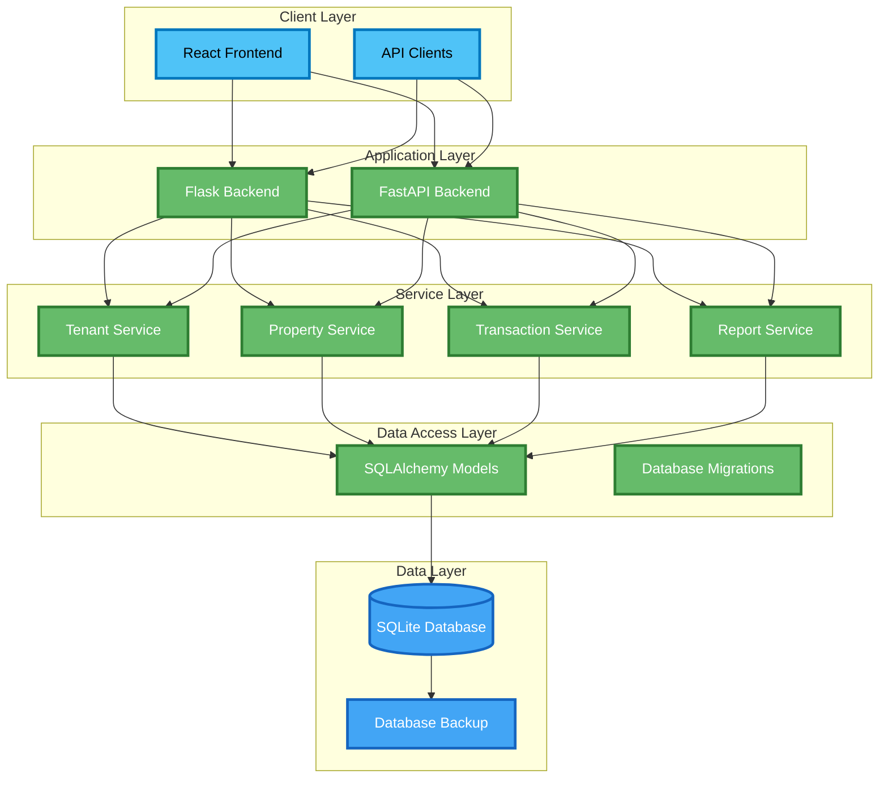
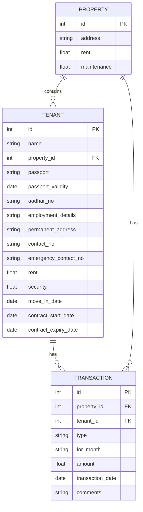
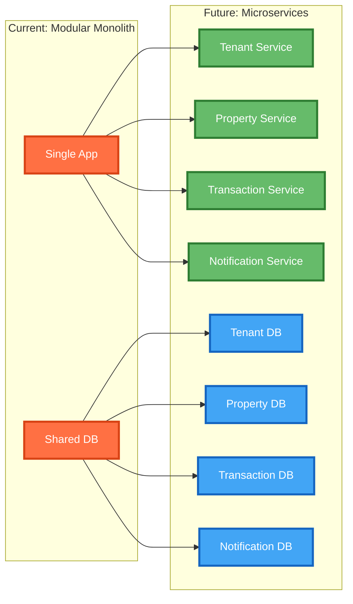

Building on our [modular monolith evolution](/learning/architecture/refactoring/tenant-management-modular-monolith/), today I want to dive deep into the **system architecture** of the Tenant Management System. This post explores the architectural decisions, component relationships, and design patterns that make this modular monolith scalable and maintainable.

> **Evolution Context**: This post is part of [Evolution 2: Modular Architecture](/projects/tenant-management/evolution-2/) in the [Tenant Management Evolutionary Project](/projects/tenant-management/). This evolution focuses on system architecture and design patterns, building upon the modular monolith foundation established in the previous evolution.

> **Requirements Context**: This system architecture is designed to fulfill the requirements outlined in [Landlord-Tenant Management System: Requirements and Objectives](/learning/requirements/analysis/tenant-management-requirements/). The requirements post provides the business context and user stories that informed these architectural decisions.

## System Architecture Overview

The Tenant Management System follows a **modular monolith architecture** with clear separation of concerns while maintaining a single deployment unit and shared database.

### High-Level Architecture Diagram



## Modular Monolith Architecture

### Core Architectural Principles

**1. Layered Architecture**
The system follows a clean layered architecture with clear separation of concerns:

```python
# Layered structure
├── Presentation Layer (React Frontend)
├── API Layer (Flask/FastAPI Routes)
├── Service Layer (Business Logic)
├── Data Access Layer (SQLAlchemy Models)
└── Data Layer (SQLite Database)
```

**2. Service Layer Pattern**
Business logic is encapsulated in service classes:

```python
# Service layer implementation
class TenantService:
    @staticmethod
    def get_tenant_by_id(tenant_id):
        """Get tenant by ID with error handling."""
        tenant = Tenant.query.get(tenant_id)
        if not tenant:
            raise ValueError(f"Tenant with ID {tenant_id} not found")
        return tenant
    
    @staticmethod
    def create_tenant(data):
        """Create new tenant with validation."""
        # Business logic for tenant creation
        tenant = Tenant(**data)
        db.session.add(tenant)
        db.session.commit()
        return tenant
```

**3. Dual Backend Implementation**
Both Flask and FastAPI backends provide the same functionality:

```python
# Flask implementation
@api.route('/tenants', methods=['GET'])
def get_tenants():
    try:
        tenants = TenantService.get_all_tenants()
        return jsonify(tenants)
    except Exception as e:
        return jsonify({'error': str(e)}), 500

# FastAPI implementation
@app.get("/tenants", response_model=List[TenantOut])
def get_tenants(db: Session = Depends(get_db)):
    return TenantService.get_all_tenants(db)
```

## Component Architecture

### Frontend Architecture (React SPA)

**Component Structure:**
```
frontend/src/
├── components/
│   ├── Navigation.js          # Main navigation
│   ├── Dashboard.js           # Dashboard overview
│   ├── Tenants.js             # Tenant management
│   ├── Properties.js          # Property management
│   ├── Transactions.js        # Transaction management
│   └── modals/                # Modal components
│       ├── TenantDetailsModal.js
│       ├── TenantTransactionsModal.js
│       └── PropertyTransactionsModal.js
├── App.js                     # Main application
└── App.css                    # Global styles
```

**State Management:**
```javascript
// Component-level state management
const Tenants = () => {
  const [tenants, setTenants] = useState([]);
  const [loading, setLoading] = useState(false);
  const [properties, setProperties] = useState([]);
  
  // API integration
  const fetchTenants = useCallback(async () => {
    setLoading(true);
    try {
      const res = await axios.get(`/api/tenants?page=${page}&per_page=${perPage}`);
      setTenants(res.data.tenants || []);
    } catch (error) {
      toast.error('Failed to fetch tenants');
    } finally {
      setLoading(false);
    }
  }, [page, perPage]);
};
```

### Backend Architecture

**Flask Backend Structure:**
```
backend/
├── app.py              # Application factory
├── config.py           # Configuration management
├── models.py           # Database models
├── routes.py           # API routes
├── services.py         # Business logic
└── swagger.py          # API documentation
```

**FastAPI Backend Structure:**
```
fastapi_backend/
├── main.py             # FastAPI application
├── config.py           # Configuration
├── database.py         # Database connection
├── models.py           # Database models
└── schemas.py          # Pydantic schemas
```

## Data Architecture

### Shared Database Pattern
The modular monolith uses a single SQLite database shared across all modules:

```python
# Shared database configuration
DATABASE_URI = os.getenv('DATABASE_URI', 'sqlite:///app.db')

# All services use the same database
class Tenant(Base):
    __tablename__ = 'tenant'
    # ... tenant fields

class Property(Base):
    __tablename__ = 'property'
    # ... property fields

class Transaction(Base):
    __tablename__ = 'transaction'
    # ... transaction fields
```

### Database Relationships


## API Architecture

### RESTful API Design
Consistent API endpoints across both backends:

```yaml
API Endpoints:
  Tenants:
    GET /api/tenants              # List tenants
    GET /api/tenants/{id}         # Get specific tenant
    POST /api/tenants             # Create tenant
    PUT /api/tenants/{id}         # Update tenant
    DELETE /api/tenants/{id}      # Delete tenant
    
  Properties:
    GET /api/properties           # List properties
    GET /api/properties/{id}      # Get specific property
    POST /api/properties          # Create property
    PUT /api/properties/{id}      # Update property
    DELETE /api/properties/{id}   # Delete property
    
  Transactions:
    GET /api/transactions         # List transactions
    GET /api/transactions/{id}    # Get specific transaction
    POST /api/transactions        # Create transaction
    PUT /api/transactions/{id}    # Update transaction
    DELETE /api/transactions/{id} # Delete transaction
    
  Reports:
    GET /api/reports/tenants_csv      # Export tenants CSV
    GET /api/reports/properties_csv   # Export properties CSV
    GET /api/reports/transactions_csv # Export transactions CSV
    GET /api/backup                   # Database backup
```

### API Consistency
Both backends expose identical APIs with different implementations:

```python
# Flask route
@api.route('/tenants', methods=['GET'])
def get_tenants():
    try:
        page = request.args.get('page', 1, type=int)
        per_page = request.args.get('per_page', 10, type=int)
        
        tenants = Tenant.query.paginate(
            page=page, per_page=per_page, error_out=False
        )
        
        return jsonify({
            'tenants': [tenant.to_dict() for tenant in tenants.items],
            'total': tenants.total,
            'pages': tenants.pages,
            'current_page': tenants.page
        })
    except Exception as e:
        return jsonify({'error': str(e)}), 500

# FastAPI route
@app.get("/tenants", response_model=List[TenantOut])
def get_tenants(
    page: int = Query(1, ge=1),
    per_page: int = Query(10, ge=1, le=100),
    db: Session = Depends(get_db)
):
    # Same functionality, different implementation
    return TenantService.get_all_tenants(db)
```

## Development Architecture

### Development Workflow
```bash
# Option 1: Flask + React
uv run python run.py              # Flask backend (port 5000)
cd frontend && npm start          # React frontend (port 3000)

# Option 2: FastAPI + React
uv run uvicorn fastapi_backend.main:app --reload  # FastAPI backend (port 8000)
cd frontend && npm start                          # React frontend (port 3000)
```

### Configuration Management
```python
# Environment-based configuration
class Config:
    DATABASE_URI = os.getenv('DATABASE_URI', 'sqlite:///app.db')
    CORS_ORIGINS = os.getenv('CORS_ORIGINS', 'http://localhost:3000').split(',')
    SECRET_KEY = os.getenv('SECRET_KEY', 'dev-secret-key')
    
    @staticmethod
    def init_app(app):
        app.config['SQLALCHEMY_DATABASE_URI'] = Config.DATABASE_URI
        app.config['SQLALCHEMY_TRACK_MODIFICATIONS'] = False
```

## Why Modular Monolith?

### Benefits of This Architecture

**1. Clean Separation Without Complexity**
- Clear module boundaries
- Single deployment unit
- Shared database for consistency
- Easy to understand and maintain

**2. Development Efficiency**
- Fast development cycles
- Easy debugging (single process)
- Simple testing setup
- No network latency between modules

**3. Future Microservices Path**
- Clear service boundaries already defined
- Easy to extract services later
- Service layer pattern in place
- API contracts already established

### Trade-offs

**Advantages:**
- ✅ Simple deployment and operations
- ✅ Easy debugging and testing
- ✅ No network complexity
- ✅ ACID transactions across modules
- ✅ Single database backup/restore

**Limitations:**
- ❌ Single point of failure
- ❌ Technology lock-in
- ❌ Scaling limitations
- ❌ Team coordination challenges

## Scalability Considerations

### Current Scalability
- **Vertical Scaling**: Add more CPU/memory to single instance
- **Database Optimization**: Indexing, query optimization
- **Caching**: Add Redis for session/data caching
- **CDN**: Static asset delivery

### Future Microservices Evolution


## Key Architectural Decisions

### 1. **Why Modular Monolith Over Microservices?**
- **Simplicity**: Easier to develop, test, and deploy
- **Performance**: No network latency between modules
- **Consistency**: ACID transactions across all operations
- **Learning**: Focus on clean architecture without operational complexity

### 2. **Why Dual Backend Implementation?**
- **Learning**: Compare Flask vs FastAPI approaches
- **Flexibility**: Choose the best tool for the job
- **Documentation**: FastAPI auto-generates API docs
- **Type Safety**: FastAPI provides better type checking

### 3. **Why Shared Database?**
- **Consistency**: ACID transactions across modules
- **Simplicity**: Single database to manage
- **Performance**: No distributed transaction complexity
- **Development**: Easy to set up and test

## Future Architecture Evolution

### Planned Enhancements
- **Service Extraction**: Extract services as they grow
- **Event-Driven Architecture**: Add message queues for loose coupling
- **CQRS**: Separate read and write models
- **GraphQL**: Unified API across all services

### Migration Strategy
```python
# Service extraction example
class TenantService:
    # Current: In-memory service
    def get_tenant(self, tenant_id):
        return Tenant.query.get(tenant_id)
    
    # Future: HTTP service call
    def get_tenant(self, tenant_id):
        response = requests.get(f"{TENANT_SERVICE_URL}/tenants/{tenant_id}")
        return response.json()
```

## Key Takeaways

### What I Learned About Modular Monolith Architecture
1. **Clean Architecture**: Proper separation of concerns within a monolith
2. **Service Layer Pattern**: Business logic encapsulation
3. **API Design**: Consistent interfaces across implementations
4. **Database Design**: Shared database with clear module boundaries

### Skills Gained
- **Modular Monolith Design**: Clean architecture within a single application
- **Service Layer Pattern**: Business logic separation
- **API Consistency**: Multiple backend implementations
- **Database Architecture**: Shared database with module boundaries
- **Development Workflow**: Coordinating multiple services

## The Architecture in Practice

You can explore the architectural decisions in the codebase:
- **Modular Structure**: [`tenant-management-modular/`](https://github.com/javiator/tenant-management-applications/tree/main/tenant-management-modular)
- **Service Layer**: Business logic in `services.py`
- **API Design**: RESTful endpoints in `routes.py`
- **Database Models**: SQLAlchemy models in `models.py`

## Final Thoughts

The modular monolith architecture provides the perfect balance between **simplicity and structure**. It gives us clean separation of concerns without the operational complexity of microservices, making it an excellent stepping stone for learning clean architecture principles.

The dual backend implementation (Flask + FastAPI) demonstrates how the same business logic can be exposed through different frameworks, providing valuable insights into API design and framework comparison.

## Evolution Progression

This system architecture analysis represents the culmination of Evolution 2:
- **From Evolution 1**: Built upon the single-file foundation and domain understanding
- **Evolution 2**: Established modular architecture and service layer patterns
- **Next Steps**: Transitioning to enterprise-ready patterns with Java/Spring Boot





## Conclusion

The modular monolith architecture provides the perfect balance between simplicity and structure. It demonstrates how clean architecture principles can be applied within a single deployment unit, making it an excellent stepping stone for learning enterprise patterns. This foundation prepares the system for the next evolutionary step toward enterprise-ready architecture.

**Next up**: I'll dive deeper into the component architecture, exploring the internal design of individual modules and how they implement the business logic - stay tuned!
