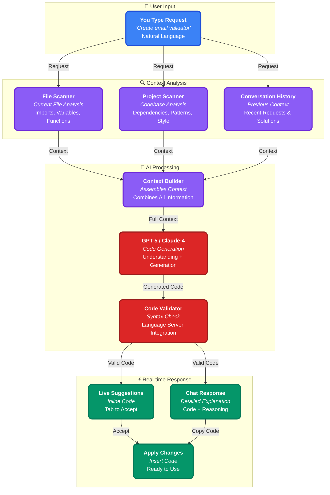

I've been absolutely amazed by how **Cursor** is revolutionizing software development. The ability to describe what you want in natural language and watch it transform into working code is nothing short of magical. Today, I want to dive deep into what happens behind the scenes when you type a request in Cursor.

> **The Magic**: When you type "Create a function that validates email addresses" in Cursor, an incredible sequence of AI processing happens in milliseconds. It's like having a senior developer pair-programming with you 24/7.

## What Happens When You Type a Request in Cursor

## The Step-by-Step Process

### 1. **Instant Context Analysis** (0-50ms)
When you type your request, Cursor immediately:
- **Scans your current file** for imports, variables, and function signatures
- **Analyzes your project structure** to understand dependencies and patterns
- **Reviews conversation history** to maintain context from previous requests
- **Identifies your coding style** from existing code patterns

### 2. **Context Assembly** (50-100ms)
Cursor combines all gathered information:
- **File context**: What's in your current file
- **Project context**: How your codebase is structured
- **Historical context**: What you've been working on
- **Style context**: Your coding conventions and preferences

### 3. **AI Processing** (100-500ms)
The assembled context is sent to the AI model:
- **GPT-5 or Claude-4** processes your request with full context
- **Generates appropriate code** that matches your project's style
- **Includes proper imports** and dependencies
- **Follows your coding patterns** and conventions

### 4. **Real-time Response** (500-1000ms)
Cursor delivers the results in multiple ways:
- **Inline suggestions** appear as you type (Tab to accept)
- **Chat interface** provides detailed explanations
- **Code validation** ensures syntax correctness
- **Ready-to-use code** that fits seamlessly into your project

## The Magic of Context Awareness

What makes Cursor truly powerful is its **contextual understanding**:

- **Project Awareness**: Knows your entire codebase structure
- **Style Matching**: Generates code that matches your existing patterns
- **Dependency Management**: Automatically includes necessary imports
- **Pattern Recognition**: Understands your coding conventions

## Real-World Example

When you type: *"Create a function that validates email addresses"*

Cursor instantly:
1. **Analyzes** your current file's imports and style
2. **Checks** if you're using a specific validation library
3. **Generates** code that matches your project's patterns
4. **Includes** proper error handling and documentation
5. **Suggests** the code inline or in chat

## The Future is Here

What amazes me most is how Cursor is democratizing software development. Complex tasks that once required deep expertise are now accessible through natural language. It's not about replacing developers - it's about amplifying human creativity and problem-solving.

The combination of **instant context analysis**, **intelligent code generation**, and **seamless integration** is creating a new paradigm in software development. We're not just writing code faster - we're thinking about problems differently.

**The question isn't whether AI will change development - it's how quickly we'll adapt to this new reality.**

