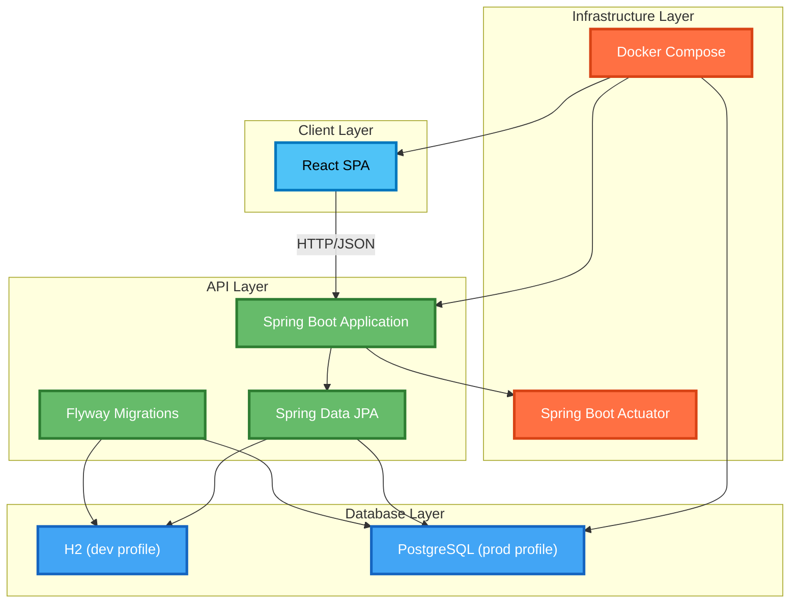
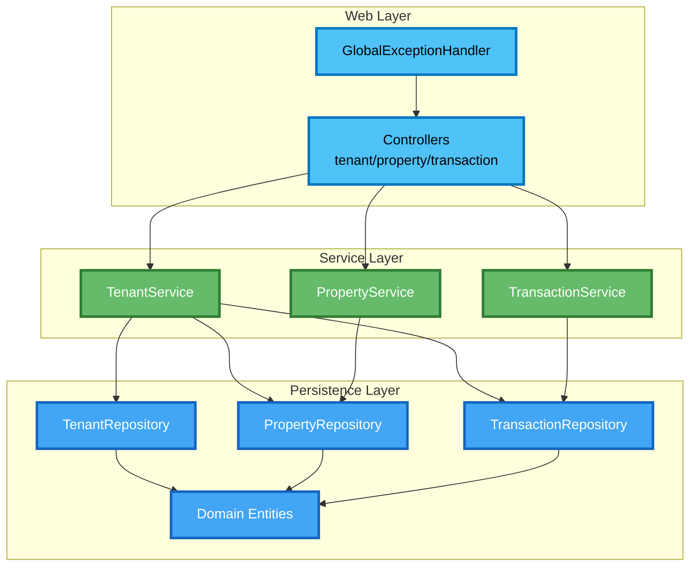
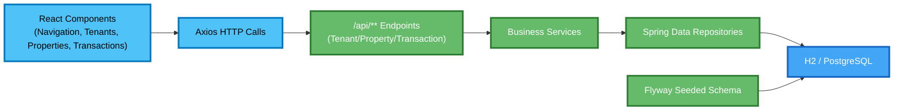

Building on the hands-on migration I shared in [Tenant Management App: Spring Boot and React Transition](/learning/development/java/tenant-management-java-transition/), this post documents the **current architecture baseline** for the new Java-based system. Right now the focus is scaffolding: wiring Spring Boot, Flyway, and the React frontend so the upcoming feature work has a solid foundation, while still keeping the modular principles from the earlier [modular monolith evolution](/learning/architecture/refactoring/tenant-management-modular-monolith/) in sight.

> **Evolution Context**: This post is part of [Evolution 3: Java Enterprise Stack](/projects/tenant-management/evolution-3/) in the [Tenant Management Evolutionary Project](/projects/tenant-management/). This evolution focuses on enterprise patterns and Spring Boot migration, building upon the modular architecture established in [Evolution 2](/projects/tenant-management/evolution-2/).

## System Architecture Overview

The application is still a single deployable unit, but each layer now has its own responsibilities. Spring Boot handles the API shell, Flyway protects the schema, and the React client keeps the presentation layer independent while the Java endpoints come online.



## Layered Architecture Principles

1. **Presentation Layer (React SPA)** – Create React App with Material UI mirrors the existing UX and communicates via axios while the new endpoints are being built.
2. **API Layer (Spring Boot)** – The `TenantManagementApplication` bootstrap loads Spring Web, Validation, Data JPA, Actuator, Flyway, and Springdoc so controllers can be dropped in with minimal ceremony.
3. **Persistence Layer** – Flyway migrations rebuild the schema and seed data; Spring Data JPA is ready for repositories once the domain is ported.
4. **Database Layer** – H2 backs development runs, while Docker Compose can attach PostgreSQL when a production-like environment is needed.
5. **Infrastructure Layer** – Docker Compose orchestrates the services; Actuator exposes `/actuator/health` and friends for container checks and future monitoring.

## Application Architecture



This mirrors the current package layout: `web/` hosts controllers and exception handling, `service/` contains transactional logic, and `repository/` bridges into the domain entities generated by Flyway.

## Component Connections



The diagram highlights the runtime flow: React screens call the axios client, which targets the REST controllers. Those controllers delegate to Spring services and repositories, while Flyway keeps the database schema aligned across H2 and PostgreSQL profiles.

## Backend Architecture Details

```java
// backend/src/main/java/com/example/tenantmanagement/TenantManagementApplication.java
@SpringBootApplication
public class TenantManagementApplication {
    public static void main(String[] args) {
        SpringApplication.run(TenantManagementApplication.class, args);
    }
}
```

- **Auto-configuration** brings the required Spring starters online so the next increment (controllers, services, repositories) only has to focus on domain logic.
- **Profile-aware Bootstrapping** lets the same binary target H2 or PostgreSQL by toggling the `SPRING_PROFILES_ACTIVE` environment variable.
- **Flyway-first approach** ensures schema consistency before any Java entities are introduced.

## Frontend Integration

```jsx
// frontend/src/components/Tenants.js
const handleSubmit = async (e) => {
  e.preventDefault();
  try {
    const payload = toPayload(form);
    if (editingId) {
      await axios.put(`/api/tenants/${editingId}`, payload);
      toast.success('Tenant updated');
    } else {
      await axios.post('/api/tenants', payload);
      toast.success('Tenant added');
    }
    setForm(initialForm);
    setEditingId(null);
    setOpenForm(false);
    fetchTenants();
  } catch (e) {
    toast.error('Save failed');
  }
};
```

- **Axios-powered CRUD**: The frontend now performs full create/update operations through the Spring Boot API (`POST`/`PUT` calls) and refreshes the tenant list via `fetchTenants`.
- **Material UI UX**: Tables, dialogs, pagination, and icons from `@mui/material` and `@mui/icons-material` remain the backbone of the interface, aligning with the existing design system.
- **Toast-driven Feedback**: `react-hot-toast` surfaces success and error states for every API interaction, matching the patterns established in earlier versions.

## Deployment and Operations

```yaml
# docker-compose.yml
services:
  api:
    build: ./backend
    container_name: tenantmgmt_api
    ports:
      - "8080:8080"
    environment:
      SPRING_PROFILES_ACTIVE: ${PROFILE:-dev}
      SPRING_DATASOURCE_URL: jdbc:postgresql://db:5432/tenantdb
      SPRING_DATASOURCE_USERNAME: tenant
      SPRING_DATASOURCE_PASSWORD: tenant
    volumes:
      - h2-data:/app/data
  frontend:
    build: ./frontend
    container_name: tenant-management-frontend
    ports:
      - "3000:3000"
    depends_on:
      - api
  db:
    image: postgres:16
    container_name: tenantmgmt_db
    profiles:
      - prod
    environment:
      POSTGRES_DB: tenantdb
      POSTGRES_USER: tenant
      POSTGRES_PASSWORD: tenant
    volumes:
      - pgdata:/var/lib/postgresql/data
volumes:
  pgdata:
  h2-data:
```

- **Profile Switching** – Running `docker compose up` defaults to the dev/H2 profile; setting `PROFILE=prod` introduces the Postgres container.
- **Actuator Health Checks** – `/actuator/health` is exposed by default so Compose (or a future orchestrator) can monitor the API container.
- **Shared Volume for H2** – The `h2-data` volume keeps the embedded H2 database files available between runs.

## Looking Ahead

- **Expose REST Controllers** – Port the Flask CRUD endpoints to Spring MVC and wire them to repositories.
- **springdoc OpenAPI UI** – Configure the already-added dependency so API docs spin up automatically with the new endpoints.
- **Automated Tests** – Add Testcontainers-based integration tests to validate the Flyway migrations and repository interactions.
- **Observability Enhancements** – Layer in Micrometer with Prometheus/Grafana once the service starts processing real workload metrics.

This baseline keeps the independence and discoverability goals of the blog framework while pushing the Tenant Management project toward an enterprise-ready Java stack. Upcoming posts will cover domain-driven refinements, CI/CD automation, and production deployment experiments.

## Key Learnings

- **Layered Architecture**: Spring Boot's layered approach provides clear separation of concerns while maintaining flexibility
- **Database Migration**: Flyway ensures schema consistency across development and production environments
- **Containerization**: Docker Compose orchestration enables consistent development and deployment workflows
- **Profile Management**: Environment-specific configurations support different deployment scenarios
- **Enterprise Patterns**: Spring Boot's convention-over-configuration approach accelerates development while maintaining quality

## Evolution Progression

This architecture represents a significant advancement in the evolutionary journey:
- **From Evolution 2**: Built upon the modular monolith architecture and service layer patterns
- **To Evolution 3**: Introduced enterprise-ready patterns, containerization, and Java ecosystem depth
- **Next Steps**: Focus on REST API implementation, testing strategies, and production deployment





## Conclusion

This architecture keeps the independence and discoverability goals of the blog framework while pushing the Tenant Management project into an enterprise-ready Java stack. Upcoming posts will cover domain-driven refinements, CI/CD automation, and production deployment experiments.
