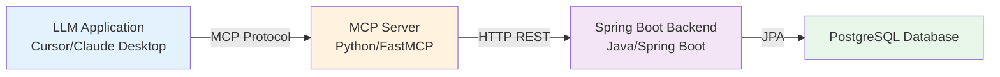

Today marks a significant milestone in the Tenant Management evolutionary journey: we're taking our first step into the **AI/LLM world** by creating a **Model Context Protocol (MCP) server** that bridges our Spring Boot REST API with AI-powered applications. This conversion transforms our enterprise Java backend into an AI-ready system that can be seamlessly integrated with LLM-supported tools like Cursor, Claude Desktop, and other MCP-compatible clients.

> **Evolution Context**: This post is part of [Evolution 4: AI Integration Layer LLM APIs + MCP Enhanced UX](/projects/tenant-management/evolution-4/) in the [Tenant Management Evolutionary Project](/projects/tenant-management/). This evolution focuses on AI integration and enhanced user experience, building upon the enterprise-ready Spring Boot application established in [Evolution 3](/projects/tenant-management/evolution-3/).

> **Requirements Context**: This iteration continues to fulfill the functional goals from [Landlord-Tenant Management System: Requirements and Objectives](/learning/requirements/analysis/tenant-management-requirements/) while introducing AI-powered capabilities that enhance the user experience.

## Why MCP? The Bridge Between Enterprise APIs and AI

The **Model Context Protocol (MCP)** is an open protocol that enables AI applications to securely access external data sources and tools. By converting our REST API into an MCP server, we're creating a standardized interface that allows LLMs to interact with our tenant management system naturally, without requiring custom API integrations.

### The Problem We're Solving

Traditional REST APIs require:
- **Explicit HTTP calls**: Developers must write HTTP client code
- **Manual error handling**: Each client must implement retry logic and error recovery
- **Schema awareness**: Clients need to understand request/response formats
- **Authentication complexity**: Each client must handle auth tokens

MCP solves these challenges by:
- **Standardized tool interface**: LLMs can discover and use tools automatically
- **Built-in error handling**: Protocol-level error management
- **Type-safe schemas**: Automatic validation and type checking
- **Unified authentication**: Protocol-level auth handling

## Architecture Overview: REST API → MCP Server

The MCP server acts as a **translation layer** between our Spring Boot REST API and AI applications:



### Key Components

1. **MCP Server (Python)**: FastMCP-based server that exposes backend capabilities as MCP tools
2. **HTTP Client Layer**: Async HTTP client (`httpx`) that communicates with Spring Boot backend
3. **Schema Layer**: Pydantic models for type-safe request/response validation
4. **Tool Registry**: Organized tool registration for properties, tenants, and transactions

## Project Structure: Clean Separation of Concerns

The MCP project follows a clean, modular architecture:

```
tenant-management-mcp/
├── pyproject.toml          # uv project definition
├── README.md               # Tool catalogue and usage
├── .env.example            # Configuration template
└── src/tm_mcp/
    ├── __init__.py
    ├── __main__.py         # Entry point
    ├── config.py           # Pydantic settings
    ├── http_client.py      # HTTP wrapper + error handling
    ├── schemas.py          # Pydantic models and adapters
    ├── server.py           # FastMCP server factory
    └── tools/              # Tool registrations by domain
        ├── properties.py
        ├── tenants.py
        └── transactions.py
```

### Design Principles

- **Thin Tool Layer**: Tools validate input, call backend, return typed data
- **No Shared State**: Each tool invocation is independent
- **Type Safety**: Pydantic models ensure data integrity
- **Error Handling**: Centralized error handling with `BackendApiError`
- **Async First**: All HTTP operations use async/await for performance

## Implementation Deep Dive

### 1. Configuration Management

The server uses Pydantic for environment-based configuration:

```python
# config.py
from pydantic import BaseSettings

class Settings(BaseSettings):
    base_url: str = "http://localhost:8080"
    api_token: Optional[str] = None
    
    class Config:
        env_prefix = "BACKEND_MCP_"
```

This approach provides:
- **Type safety**: Configuration is validated at startup
- **Environment flexibility**: Easy configuration via environment variables
- **Clear defaults**: Sensible defaults for local development

### 2. HTTP Client Abstraction

The HTTP client layer encapsulates all backend communication:

```python
# http_client.py
async def request_json(
    method: str,
    path: str,
    *,
    params: Optional[Mapping[str, Any]] = None,
    body: Optional[Any] = None,
    adapter: TypeAdapter[T],
) -> T:
    """Send a request and parse the JSON body with type validation."""
    response = await _send(method, path, params=params, body=body)
    payload = response.json()
    return adapter.validate_python(payload)
```

Key features:
- **Automatic error handling**: Non-2xx responses raise `BackendApiError`
- **Type validation**: Pydantic adapters ensure response shape matches schema
- **Bearer token support**: Automatic auth header injection
- **Timeout management**: Built-in request timeouts

### 3. Tool Registration Pattern

Each domain (properties, tenants, transactions) follows a consistent pattern:

```python
# tools/properties.py
def register_property_tools(server) -> None:
    @server.tool(
        name="list_properties",
        description="Retrieve every property managed by the backend.",
    )
    async def list_properties() -> list[Property]:
        return await request_json(
            "GET", 
            "/api/properties", 
            adapter=property_list_adapter
        )
    
    @server.tool(
        name="create_property",
        description="Create a property. Requires address, rent, and maintenance.",
    )
    async def create_property(payload: PropertyInput) -> Property:
        return await request_json(
            "POST",
            "/api/properties",
            body=payload.model_dump(),
            adapter=property_adapter,
        )
```

Benefits:
- **Self-documenting**: Tool descriptions help LLMs understand purpose
- **Type hints**: Return types guide LLM tool selection
- **Consistent patterns**: Easy to add new tools following the same structure

### 4. Schema Validation Layer

Pydantic models ensure data integrity at both boundaries:

```python
# schemas.py
class Property(BaseModel):
    id: PositiveInt
    address: str = Field(min_length=1)
    rent: float
    maintenance: float
    
    model_config = {"extra": "ignore"}

class PropertyInput(BaseModel):
    address: str = Field(min_length=1)
    rent: float
    maintenance: float
```

The schema layer provides:
- **Input validation**: Invalid data is caught before backend calls
- **Response validation**: Backend responses are validated against expected shape
- **Type adapters**: Efficient validation using Pydantic's TypeAdapter

## Complete Tool Catalogue

The MCP server exposes **15 tools** across three domains:

### Property Tools (5 tools)
- `list_properties` - Fetch all properties
- `get_property` - Load property by ID
- `create_property` - Create new property
- `update_property` - Update existing property
- `delete_property` - Remove property
- `list_property_transactions` - Get transactions for a property

### Tenant Tools (6 tools)
- `list_tenants` - Fetch all tenants with property info
- `get_tenant` - Load tenant by ID
- `create_tenant` - Create new tenant
- `update_tenant` - Update tenant fields
- `delete_tenant` - Remove tenant
- `list_tenant_transactions` - Get transactions for a tenant

### Transaction Tools (5 tools)
- `list_transactions` - Fetch all transactions
- `get_transaction` - Load transaction by ID
- `create_transaction` - Create new transaction
- `update_transaction` - Update transaction fields
- `delete_transaction` - Remove transaction

**Payment Logic**: Transactions with type `payment_received` represent money collected from tenants. All other types (rent, security, utilities, maintenance) represent outstanding charges.

## Usage Example: AI-Powered Tenant Management

With the MCP server running, an LLM can now interact with the tenant management system naturally:

**User**: "Show me all tenants who haven't paid rent this month"

**LLM Response** (using MCP tools):
1. Calls `list_tenants` to get all tenants
2. Calls `list_transactions` to get recent transactions
3. Filters for tenants without `payment_received` transactions this month
4. Provides a natural language summary

**User**: "Create a new property at 400 Market Street with rent $1800 and maintenance $150"

**LLM Response**:
1. Calls `create_property` with the provided details
2. Confirms property creation with the returned property ID

This natural interaction pattern is what makes MCP powerful—it bridges the gap between human language and API calls.

## Technical Achievements

### ✅ Protocol Implementation
- **FastMCP Integration**: Leveraged the `mcp` library's FastMCP server
- **Tool Discovery**: Automatic tool registration and discovery
- **Type Safety**: Full type hints for LLM tool selection

### ✅ Backend Integration
- **REST API Mapping**: Complete mapping of Spring Boot REST endpoints
- **Error Handling**: Centralized error handling with meaningful messages
- **Authentication**: Bearer token support for secured deployments

### ✅ Developer Experience
- **uv Package Management**: Modern Python dependency management
- **Async/Await**: High-performance async HTTP operations
- **Pydantic Validation**: Type-safe request/response handling
- **Clear Documentation**: Comprehensive README with tool catalogue

### ✅ Production Readiness
- **Environment Configuration**: Flexible configuration via environment variables
- **Error Recovery**: Graceful handling of backend failures
- **Schema Validation**: Prevents invalid data from reaching backend
- **Extensible Design**: Easy to add new tools following established patterns

## Evolution Progression: From REST to AI-Ready

This MCP conversion represents a significant architectural evolution:

- **Evolution 1-2**: Python-based applications with REST APIs
- **Evolution 3**: Enterprise Java stack with Spring Boot REST API
- **Evolution 4 (Current)**: AI integration layer via MCP protocol
- **Future**: Conversational interfaces and enhanced AI capabilities

The MCP server doesn't replace the REST API—it **enhances** it by making it accessible to AI applications. The Spring Boot backend remains the source of truth, and the MCP server acts as a protocol adapter.

## Key Learnings

### MCP Protocol Understanding
- **Tool-based Architecture**: MCP uses tools as the fundamental abstraction
- **Schema-driven**: Tool schemas enable automatic LLM integration
- **Protocol Benefits**: Standardized interface reduces integration complexity

### Python Async Patterns
- **httpx AsyncClient**: Modern async HTTP client for backend communication
- **Type Adapters**: Efficient Pydantic validation for request/response handling
- **Error Propagation**: Clean error handling with custom exception types

### API Design Principles
- **Thin Adapter Layer**: MCP tools should be thin wrappers around backend calls
- **Type Safety**: Strong typing prevents runtime errors
- **Error Handling**: Centralized error handling improves maintainability

### AI Integration Patterns
- **Tool Discovery**: LLMs can automatically discover available tools
- **Natural Language Interface**: MCP enables natural language interaction with APIs
- **Protocol Abstraction**: MCP abstracts away HTTP details from AI applications

## Integration with MCP Clients

### Cursor Integration

The MCP server can be configured in Cursor's MCP settings:

```json
{
  "mcpServers": {
    "tenant-management": {
      "command": "uv",
      "args": ["run", "tm-mcp"],
      "env": {
        "BACKEND_MCP_BASE_URL": "http://localhost:8080"
      }
    }
  }
}
```

Once configured, Cursor's AI assistant can use all tenant management tools directly.

### Claude Desktop Integration

Similar configuration enables Claude Desktop to access the tenant management system:

```json
{
  "mcpServers": {
    "tenant-management": {
      "command": "uv",
      "args": ["run", "tm-mcp"],
      "env": {
        "BACKEND_MCP_BASE_URL": "http://localhost:8080"
      }
    }
  }
}
```

## Looking Ahead: Enhanced AI Capabilities

With the MCP foundation in place, we can now explore:

- **Natural Language Queries**: "Show me tenants with overdue payments"
- **Intelligent Automation**: "Create a rent reminder for all tenants"
- **Data Analysis**: "Which properties have the highest maintenance costs?"
- **Conversational Interface**: Chat-based interaction with the system

The MCP server opens the door to these AI-powered features while maintaining the robust backend architecture established in Evolution 3.

## Code Examples: Tool Implementation

### Property Creation Tool

```python
@server.tool(
    name="create_property",
    description="Create a property. Requires address, rent, and maintenance amount.",
)
async def create_property(payload: PropertyInput) -> Property:
    """Create a new property in the system."""
    return await request_json(
        "POST",
        "/api/properties",
        body=payload.model_dump(),
        adapter=property_adapter,
    )
```

### Transaction Listing Tool

```python
@server.tool(
    name="list_transactions",
    description="Retrieve all property and tenant transactions.",
)
async def list_transactions() -> list[Transaction]:
    """Fetch all transactions from the backend."""
    return await request_json(
        "GET",
        "/api/transactions",
        adapter=transaction_list_adapter,
    )
```

These examples demonstrate the simplicity of the tool layer—each tool is a thin wrapper that validates input, calls the backend, and returns typed data.

## Development Workflow

### Local Development

```bash
# Install dependencies
uv sync

# Run MCP server (stdio transport for MCP clients)
uv run tm-mcp

# Or run with HTTP transport for testing
uv run tm-mcp --transport streamable-http --host 0.0.0.0 --port 8000
```

### Testing Integration

The MCP server can be tested independently:

1. **Start Spring Boot backend**: `mvn spring-boot:run`
2. **Start MCP server**: `uv run tm-mcp`
3. **Connect MCP client**: Configure Cursor or Claude Desktop
4. **Test tools**: Use natural language to interact with the system

## Architecture Benefits

### For Developers
- **Standardized Interface**: One protocol for all AI integrations
- **Type Safety**: Pydantic ensures data integrity
- **Easy Extension**: Add new tools following established patterns
- **Clear Error Messages**: Meaningful errors aid debugging

### For AI Applications
- **Tool Discovery**: Automatic discovery of available capabilities
- **Natural Language**: LLMs can interact without understanding HTTP
- **Error Recovery**: Protocol-level error handling
- **Schema Awareness**: LLMs understand tool inputs/outputs

### For the System
- **Backend Agnostic**: MCP server doesn't change backend architecture
- **Protocol Abstraction**: HTTP details hidden from AI applications
- **Extensibility**: Easy to add new tools as backend evolves
- **Maintainability**: Clean separation of concerns

## Key Takeaways

1. **MCP Enables AI Integration**: The Model Context Protocol provides a standardized way to expose APIs to AI applications

2. **Thin Adapter Layer**: MCP tools should be thin wrappers around backend calls, not business logic containers

3. **Type Safety Matters**: Pydantic validation ensures data integrity at both API boundaries

4. **Protocol Benefits**: MCP abstracts HTTP complexity from AI applications, enabling natural language interaction

5. **Evolutionary Approach**: This conversion enhances the existing REST API without replacing it, maintaining backward compatibility

6. **Future-Ready**: The MCP foundation enables advanced AI features like natural language queries and intelligent automation

## Conclusion

The conversion of our Tenant Management REST API into an MCP server represents a significant step forward in making enterprise applications AI-ready. By creating a standardized protocol adapter, we've enabled natural language interaction with our system while maintaining the robust backend architecture established in Evolution 3.

This foundation sets the stage for advanced AI capabilities, including conversational interfaces, intelligent automation, and enhanced user experiences. The MCP server doesn't replace our REST API—it enhances it by making it accessible to the next generation of AI-powered applications.

As we continue Evolution 4, we'll explore how these AI capabilities can transform the user experience, making property and tenant management more intuitive and efficient than ever before.





