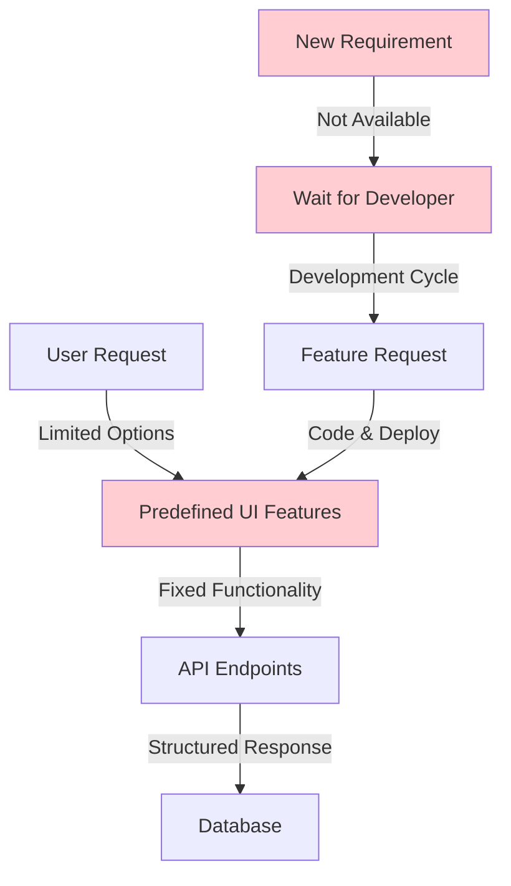
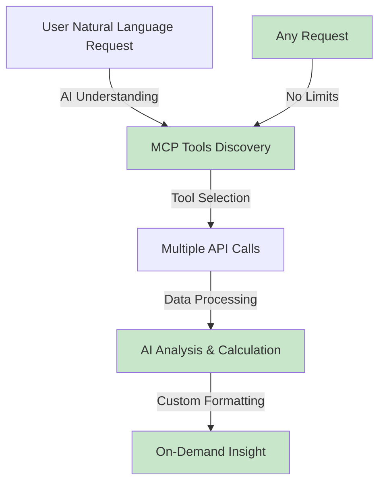
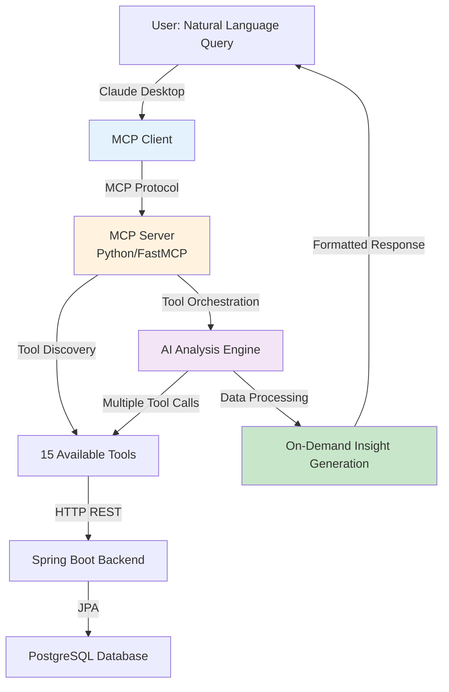

In our [previous post](/learning/development/ai-integration/tenant-management-api-mcp-conversion/), we explored the technical foundation of converting our Tenant Management REST API into an MCP server. Today, we're diving into something truly transformative: **demonstrating the unlimited possibilities that AI and MCP unlock** for users—possibilities that were simply impossible with traditional UI+API approaches.

> **Evolution Context**: This post is part of [Evolution 4: AI Integration Layer LLM APIs + MCP Enhanced UX](/projects/tenant-management/evolution-4/) in the [Tenant Management Evolutionary Project](/projects/tenant-management/). This evolution focuses on AI integration and enhanced user experience, building upon the enterprise-ready Spring Boot application established in [Evolution 3](/projects/tenant-management/evolution-3/).

> **Requirements Context**: This iteration continues to fulfill the functional goals from [Landlord-Tenant Management System: Requirements and Objectives](/learning/requirements/analysis/tenant-management-requirements/) while introducing AI-powered capabilities that dramatically enhance user flexibility and data exploration.


*The transformation from traditional UI+API constraints to MCP+AI unlimited possibilities—enabling instant, user-driven insights without developer dependencies.*

## The Traditional UI+API Limitation

In our [WebUI Demo post](/learning/development/demo/tenant-management-app-demo-webui/), we showcased a beautiful, functional React application with a Spring Boot backend. The application provided:

- ✅ Dashboard with key metrics
- ✅ Tenant management with CRUD operations
- ✅ Property management interface
- ✅ Transaction tracking and history
- ✅ Search and filter capabilities
- ✅ CSV export functionality

**But here's the critical limitation**: Users could only interact with **predefined features** that developers had explicitly coded into the UI. Want an on-demand insight? Wait for a developer to build it. Need a specific calculation? It's not available unless it was pre-programmed. Need to analyze data in a different way? You're constrained by what the interface offers.



This traditional approach creates a **dependency bottleneck**: every new insight or analysis requires developer intervention and deployment cycles.

## The MCP Revolution: Unlimited Possibilities

With our MCP server integrated into Claude Desktop (or any MCP-compatible client), users can now request **anything** they can imagine—in natural language. The AI understands the available tools, orchestrates multiple API calls, performs calculations, and presents results in whatever format makes sense.



The magic happens because:
1. **MCP Tools are Discoverable**: The AI automatically knows what tools are available
2. **Natural Language Interface**: Users express needs in plain English, not API syntax
3. **Intelligent Orchestration**: The AI can chain multiple tool calls to answer complex questions
4. **Flexible Output**: Results can be formatted as tables, summaries, calculations, or visualizations
5. **No Pre-programming Required**: New insights emerge instantly without code changes

## Real-World Demo: AI-Powered On-Demand Insights

Let's explore actual examples of what users can now accomplish with our Tenant Management MCP integration. These insights were generated **on-demand** through natural language conversations with Claude Desktop—no code changes, no deployments, just pure AI-powered flexibility.

### Example 1: Simple Tenant Count Query

**User Request**: "How many tenants do we have?"


*The AI instantly queries the MCP tools, retrieves tenant data, and provides a clear answer with context.*

This might seem simple, but notice: **no UI component needed**. The user asked a question, and the AI provided the answer by calling `list_tenants` and counting the results. In a traditional UI, you'd need to navigate to the tenants page and manually count—or hope a developer added a "tenant count" widget to the dashboard.

### Example 2: Custom Income Analysis Insight

**User Request**: "Show me the income from the last two months"


*The AI analyzes transaction data, filters by date, categorizes payment types, and presents a comprehensive income breakdown.*

This insight required:
- Fetching all transactions via `list_transactions`
- Filtering by date (last two months)
- Categorizing transactions (identifying `payment_received` vs. charges)
- Calculating totals and presenting in a readable format

**In a traditional UI**: This would require a developer to:
1. Create a new "Income Insight" page
2. Add date filtering UI components
3. Implement calculation logic
4. Design the insight layout
5. Test and deploy

**With MCP + AI**: The user simply asks, and the insight appears instantly.

### Example 3: Tenant-Specific Financial Summary

**User Request**: "Give me a summary of tenant 4's details"


*The AI retrieves tenant information, analyzes associated transactions, and provides a comprehensive financial summary.*

This insight combines:
- Tenant details from `get_tenant`
- Transaction history from `list_tenant_transactions`
- Financial calculations (outstanding amounts, payments received)
- Contextual analysis (contract status, payment patterns)

**The power**: The AI understands the relationship between tenants and transactions, performs calculations automatically, and presents insights that weren't pre-programmed anywhere.

### Example 4: Advanced Payment Analysis

**User Request**: "Show me tenants with payments pending"


*The AI analyzes all tenants, cross-references transaction data, calculates outstanding balances, and identifies tenants with pending payments.*

This is a **complex multi-step analysis**:
1. Fetch all tenants (`list_tenants`)
2. Fetch all transactions (`list_transactions`)
3. For each tenant, calculate:
   - Total charges (rent, maintenance, utilities)
   - Total payments received
   - Outstanding balance
4. Filter tenants with outstanding balances
5. Format as a comprehensive insight

**Traditional approach**: This would be a major feature requiring:
- New backend endpoint for balance calculations
- Frontend page with complex logic
- Database queries optimization
- UI design and testing
- Weeks of development time

**MCP + AI approach**: Instant, flexible, and adaptable to any variation of the question.

### Example 5: Graphical Income Visualization

**User Request**: "Show me tenant income report in a graphical format"


*The AI creates a visual representation of income data, making trends and patterns immediately apparent.*

The AI not only retrieves and calculates data but also **formats it visually** using markdown tables and structured layouts. This demonstrates how MCP enables not just data retrieval but also **intelligent presentation** tailored to user needs.

## The Architecture: How It Works

The seamless experience users enjoy is powered by a clean, modular architecture:



### The MCP Tool Ecosystem

Our MCP server exposes **15 tools** across three domains:

**Property Tools** (6 tools):
- `list_properties` - Get all properties
- `get_property` - Get property by ID
- `create_property` - Create new property
- `update_property` - Update property
- `delete_property` - Remove property
- `list_property_transactions` - Get property transactions

**Tenant Tools** (6 tools):
- `list_tenants` - Get all tenants with property info
- `get_tenant` - Get tenant by ID
- `create_tenant` - Create new tenant
- `update_tenant` - Update tenant
- `delete_tenant` - Remove tenant
- `list_tenant_transactions` - Get tenant transactions

**Transaction Tools** (5 tools):
- `list_transactions` - Get all transactions
- `get_transaction` - Get transaction by ID
- `create_transaction` - Create transaction
- `update_transaction` - Update transaction
- `delete_transaction` - Remove transaction

The AI can **orchestrate these tools** in any combination to answer complex questions, perform calculations, and generate on-demand insights—all without any pre-programmed logic.

## Key Advantages: Traditional vs. AI-Powered

### Traditional UI+API Approach

| Aspect | Limitation |
|--------|------------|
| **Feature Discovery** | Users must navigate UI to find features |
| **On-Demand Insights** | Requires developer to build new pages/components |
| **Data Analysis** | Limited to pre-programmed calculations |
| **Flexibility** | Constrained by UI design decisions |
| **Time to Insight** | Days/weeks for new features |
| **User Empowerment** | Dependent on developer availability |

### MCP + AI Approach

| Aspect | Advantage |
|--------|-----------|
| **Feature Discovery** | Natural language queries reveal capabilities instantly |
| **On-Demand Insights** | Generated on-demand, no code required |
| **Data Analysis** | Unlimited calculations and comparisons |
| **Flexibility** | Adapts to any user request |
| **Time to Insight** | Instant (seconds) |
| **User Empowerment** | Self-service data exploration |

## Real-World Use Cases

### Scenario 1: Financial Planning

**Traditional**: Navigate to transactions page, export CSV, import to Excel, create pivot tables, analyze manually.

**MCP + AI**: "Show me monthly income trends for the last 6 months with projections" → Instant analysis with trends and insights.

### Scenario 2: Tenant Management

**Traditional**: Check tenant list, manually review each tenant's transactions, calculate balances in spreadsheet.

**MCP + AI**: "Which tenants have outstanding balances over $500?" → Immediate list with detailed breakdowns.

### Scenario 3: Property Analysis

**Traditional**: View properties page, manually compare rent vs. maintenance costs, calculate ROI in separate tool.

**MCP + AI**: "Compare profitability across all properties, showing rent vs. maintenance ratios" → Comprehensive comparison table.

### Scenario 4: Compliance Insights

**Traditional**: Manually compile data from multiple pages, format reports, verify calculations.

**MCP + AI**: "Generate a compliance insight showing all tenants with contracts expiring in the next 30 days, including their payment status" → Complete insight ready for review.

## The Technical Magic: Behind the Scenes

When a user asks "Show me tenants with payments pending," here's what happens:

1. **Natural Language Understanding**: Claude Desktop parses the request and understands the intent
2. **Tool Discovery**: The AI reviews available MCP tools and identifies relevant ones
3. **Orchestration Plan**: The AI determines it needs:
   - `list_tenants` to get all tenants
   - `list_transactions` to get payment data
4. **Sequential Execution**: 
   - First call: `list_tenants` → Returns tenant list
   - Second call: `list_transactions` → Returns all transactions
5. **Data Processing**: The AI:
   - Matches transactions to tenants
   - Calculates outstanding balances (charges - payments)
   - Filters tenants with pending payments
   - Organizes data logically
6. **Response Generation**: Formats results as a comprehensive insight with:
   - Clear headings
   - Structured data
   - Calculations explained
   - Actionable insights

All of this happens **automatically** without any pre-programmed logic for "pending payments insight."

## Evolution Progression: From Constraints to Freedom

This represents a fundamental shift in how users interact with enterprise applications:

- **Evolution 1-2**: Python applications with REST APIs—developers controlled all interactions
- **Evolution 3**: Enterprise Java stack with React UI—users limited to predefined features
- **Evolution 4 (Current)**: MCP integration—**users have unlimited flexibility**
- **Future**: Enhanced AI capabilities, conversational interfaces, predictive analytics

The MCP server doesn't replace our REST API or React UI—it **complements** them by providing an alternative interface that removes constraints and empowers users.

## Integration Setup: Getting Started

To enable this AI-powered experience, users simply configure Claude Desktop (or any MCP client) to connect to our MCP server:

```json
{
  "mcpServers": {
    "tenant-management": {
      "command": "uv",
      "args": ["run", "tm-mcp"],
      "env": {
        "BACKEND_MCP_BASE_URL": "http://localhost:8080"
      }
    }
  }
}
```

Once configured, users can immediately start asking questions in natural language, and the AI will use our MCP tools to provide answers.

## Key Takeaways

1. **Unlimited Flexibility**: MCP + AI removes the constraints of predefined UI features, enabling users to explore data in any way they need

2. **Instant Insights**: Complex insights and analyses that would take days to develop can be generated instantly through natural language queries

3. **User Empowerment**: Users are no longer dependent on developers for on-demand insights or data analysis—they can explore independently

4. **Backward Compatible**: The MCP layer enhances rather than replaces existing REST API and UI—all interfaces coexist

5. **Future-Ready**: This foundation enables advanced AI capabilities like predictive analytics, automated insights, and conversational interfaces

6. **Real Business Value**: The ability to answer "what if" questions instantly transforms how users interact with enterprise data

## The Future: What's Next?

With this MCP foundation in place, we can now explore:

- **Predictive Analytics**: "Which tenants are likely to have payment issues next month?"
- **Automated Insights**: "Generate weekly summary insights automatically"
- **Natural Language Updates**: "Mark tenant 4's rent as paid for November"
- **Multi-Source Integration**: Combine tenant management data with external sources
- **Conversational Workflows**: "Help me onboard a new tenant" → AI guides through the process

The possibilities are truly unlimited.

## Conclusion

The transition from traditional UI+API to MCP+AI represents more than a technical upgrade—it's a **paradigm shift** in user empowerment. Where users were once constrained by what developers built, they now have unlimited flexibility to explore, analyze, and understand their data.

The demo screenshots in this post showcase real, working examples of this transformation. Insights that would require days of development can now be generated instantly through natural language. Calculations that needed spreadsheets can happen in seconds. Discoveries that were hidden in data can be uncovered through simple questions.

This is the power of AI and MCP: **unlocking the full potential of your data** without waiting for developers to build the perfect UI. It's not about replacing traditional interfaces—it's about adding a new dimension of flexibility that makes enterprise applications truly user-centric.

As we continue Evolution 4, we'll explore even more advanced AI capabilities, but the foundation is clear: **with MCP, the possibilities are unlimited**.





