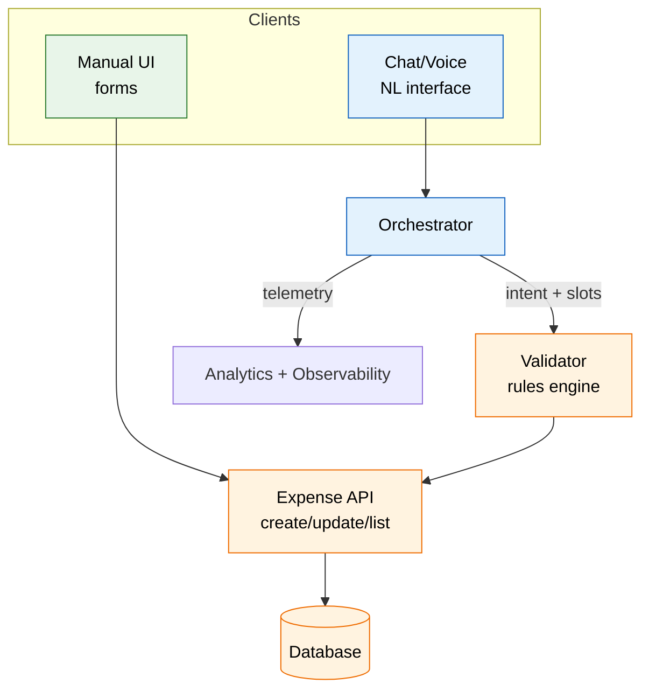

Most teams want AI in their products, but ripping out familiar workflows to bolt on a chatbot rarely ends well. This roadmap shows how to layer AI into an existing app—using a Splitwise-style expenses tool as the example—without alienating users who rely on today's manual flows.

## The challenge: introducing AI without disrupting users

When organizations decide to introduce AI capabilities into their existing applications, they face a critical decision: how to balance innovation with user familiarity. Some users are tech-savvy early adopters eager to try new AI features, while others prefer the predictability and control of traditional form-based interfaces. Simply replacing the existing UI with an AI-first approach can alienate users who have built muscle memory around the current workflow.

The solution? **Run both interfaces in parallel**—maintain the existing manual interface while introducing AI as an optional, complementary channel. This approach respects user choice, reduces adoption risk, and creates a smoother transition path to AI-enhanced experiences.


*Diagrammatic representation of the roadmap approach: introducing AI as a parallel channel alongside existing manual interfaces, enabling gradual adoption while maintaining user choice and trust.*

## Where the application stands today (manual-first)

In our example application—a Splitwise-style expense sharing tool—users currently interact through a traditional form-based interface:


*The manual interface showing expense history, balances, and the form for adding new expenses. Notice the summary section showing who owes whom, and the expense history with multiple entries.*

**Current workflow:**
- Users sign in and create a group with 4–5 members (roommates, friends, or colleagues)
- They log expenses (food, travel, utilities, misc) through structured form screens
- The UI enforces strict rules: pick a payer, select participants, choose split method (equal, percentage, or custom amounts), attach categories, and confirm totals
- Users can view expense history, see balances, and settle debts through dedicated screens

**Strengths of the manual interface:**
- **Predictable**: Users know exactly what fields to fill and what happens when they submit
- **Auditable**: Every action is explicit and traceable
- **Easy to teach**: New users can follow step-by-step instructions
- **Controlled**: Users have full control over every detail before submission

**Weaknesses:**
- **Slow data entry**: Especially on mobile devices, filling forms takes time
- **Low flexibility**: Difficult to handle bulk entries or catch up on backlogged expenses
- **No natural language forgiveness**: Users must follow strict formatting rules
- **Rigid workflow**: Must navigate through multiple screens to complete simple tasks

## Parallel AI channel: text + voice on top of existing rules

Instead of replacing the manual interface, we introduce AI as a **parallel channel** that operates alongside the existing forms. The key principle: **both interfaces use the same underlying validation and APIs**.


*The chat interface showing a conversation where expenses were added using natural language. The AI processed commands like "I paid £65 for the gas bill last month" and "Show me the summary of who owes whom," demonstrating how users can interact with the application conversationally.*

**How the AI channel works:**

The AI interface uses Google's Gemini API with function calling to understand natural language and translate it into structured actions. Here's how it works:

1. **Natural Language Understanding**: Users type or speak commands in plain English
2. **Function Calling**: The AI uses a set of predefined functions (tools) to understand intent:
   - `addExpense` - Add a single expense
   - `addMultipleExpenses` - Add multiple expenses in one message
   - `addPerson` - Add new members to the group
   - `getSummary` - Calculate who owes whom
   - `listExpenses` - View expense history (with optional time filters)
   - `updateExpense` - Modify existing expenses
   - `deleteExpense` - Remove expenses
   - `settleDebt` - Record debt settlements
   - `getPersonalSummary` - Get user-specific debt summary
   - `getTotalExpenses` - Calculate total group spending
   - `getSummaryExplanation` - Explain how balances were calculated

3. **Slot Extraction**: The AI extracts structured data from natural language:
   - **Description**: "dinner", "Uber ride", "groceries"
   - **Amount**: Handles various formats (£50, $50, 50 pounds)
   - **Payer**: Resolves names, pronouns ("me", "I"), and aliases
   - **Participants**: Extracts list of people sharing the expense
   - **Date**: Understands relative dates ("yesterday", "last Friday") and converts to YYYY-MM-DD
   - **Split method**: Detects equal splits vs. custom splits (amounts or percentages)

4. **Same validation pipeline**: All AI actions go through the same validation rules as manual form submissions
5. **Same data model**: AI creates the same `Expense` objects with the same structure as manual entries

**Critical design decision**: Keep the manual screens **fully available** and **never gatekeep features behind AI**. Users should always have the option to use the traditional interface.

**Example interactions:**

*Manual interface:*
1. Click "Add Expense"
2. Fill form: Description="Uber ride", Amount="82.50", Date="2025-10-12", Paid by="Me"
3. Select participants: Alex, Priya, Me
4. Choose split: Equal
5. Click "Add Expense"

*Chat interface:*
```
User: "Split $82.50 Uber on Oct 12 among Alex, Priya, and me; I paid."
AI: [Calls addExpense function with extracted data]
AI: "I've added the expense: Uber ride for £82.50 on Oct 12, split equally between you, Alex, and Priya."
```

Both approaches result in the same expense record in the database, using the same validation rules and data structure.

**Advanced AI capabilities:**

The chat interface can handle complex scenarios that would be tedious in the manual interface:

- **Multiple expenses at once**: "I paid £50 for dinner and £15 for the taxi, split evenly with Alice and Bob"
- **Relative dates**: "Add yesterday's lunch, £30, split between me, Sarah, and Tom"
- **Automatic person addition**: "I paid £100 for groceries with my new roommate Emma" (adds Emma automatically)
- **Complex queries**: "Show me all expenses from last month" or "How much did Bob pay in total?"
- **Natural corrections**: "Actually, that dinner was £120, not £100" (updates the expense)

**Voice input**: The chat interface supports voice input through browser speech recognition (Web Speech API). Users can speak their expense details naturally, and the system:
1. Converts speech to text
2. Processes the text through the same AI function calling pipeline
3. Creates expenses using the same validation and data model

This makes it especially convenient for mobile users who want to quickly log expenses while on the go.

## Visual comparison: Both interfaces, same data

Both interfaces access the same underlying data and APIs. The side-by-side comparison below shows how the same expense information (£601.99 total spending, same balances) is presented differently—form-based on the left, conversational on the right:

<div style="display: flex; gap: 20px; flex-wrap: wrap; margin: 20px 0;">
  <div style="flex: 1; min-width: 300px;">
    
    <p style="text-align: center; margin-top: 10px;"><strong>Manual Interface</strong><br><small>Form-based, structured input</small></p>
  </div>
  
  <div style="flex: 1; min-width: 300px;">
    
    <p style="text-align: center; margin-top: 10px;"><strong>Chat Interface</strong><br><small>Conversational, natural language</small></p>
  </div>
</div>

Notice how both screenshots show identical expense data—the same balances, same total spending, same expense history. This proves they use the same underlying data model and APIs, just with different user interfaces.

## Phased roadmap to de-risk adoption

Introducing AI features gradually allows users to build trust and familiarity while maintaining the safety net of the existing interface. Here's a phased approach that minimizes risk:

### Phase 1: Exposure only (week 1–2)

**Goal**: Make AI visible but non-threatening

- **Add chat entry point**: Place a "Chat" tab next to the "Manual" tab—users can switch between interfaces easily
- **Mirror manual flows**: Every AI action calls the same create/update endpoints as the forms
- **Show preview before submission**: Default to displaying the generated expense form before final submission so users can verify and trust the AI's interpretation
- **No forced migration**: Users can ignore the chat interface completely and continue using manual forms

**User experience**: Users see the chat option but aren't pressured to use it. Early adopters can experiment while others continue with familiar workflows.

### Phase 2: Assisted submission (week 3–4)

**Goal**: Enable one-shot interactions with safety checks

- **One-shot commands**: Allow natural language like "Add dinner $120 split evenly yesterday with Priya and Sam"
- **Always-on confirmation**: Keep a confirmation card that shows what the AI understood, with editable fields before final save
- **Telemetry capture**: Track misunderstood intents, most-used categories, manual overrides, and user corrections
- **Learn from feedback**: Use telemetry to improve intent detection and slot extraction

**User experience**: Users can complete tasks faster with AI, but always have the opportunity to review and correct before submission.

### Phase 3: Autopilot with guardrails (week 5–8)

**Goal**: Increase convenience while maintaining transparency

- **Smart corrections**: Enable silent corrections (rounding amounts, inferring dates from context) but always surface them in a "what I understood" summary
- **Voice entry**: Add quick voice entry for mobile users to clear backlogged receipts while on the go
- **Opt-out option**: Allow users to pin the manual form as their default interface
- **Confidence indicators**: Show confidence scores for AI interpretations

**User experience**: AI becomes more helpful and proactive, but users retain full control and visibility into what's happening.

### Phase 4: Adoption nudges, not mandates (week 9+)

**Goal**: Encourage AI adoption without forcing it

- **Side-by-side examples**: Show screenshots comparing the manual form vs. the equivalent chat transcript to demonstrate time savings
- **Trust badges**: Badge high-confidence intents ("95% match; no edits needed") to build trust
- **Contextual prompts**: Gradually surface AI shortcuts in empty states and non-critical screens, not in payment or settlement flows
- **Success stories**: Highlight when AI saves users time or handles complex splits correctly

**User experience**: Users are gently encouraged to try AI features, but the manual interface remains fully functional and accessible.

## UX guardrails that keep both audiences happy
- **Predictability:** Always show the resulting expense object before saving; never silently post.  
- **Traceability:** Log the AI-generated payload and the user’s final edits for audit.  
- **Recovery:** “Did I get this wrong?” button to reopen the form with prefilled fields.  
- **Performance:** Keep chat latency under ~2s; fall back to manual form if the model stalls.  
- **Accessibility:** Voice is optional; keyboard-only flows still work.  
- **Privacy:** Run PII scrubbing on transcripts; store only structured expense data.

## Architecture sketch: same domain logic, two entry points


## Implementation: How AI function calling works

The application uses Google's Gemini API with function calling (tools) to translate natural language into structured actions. Here's how a user message flows through the system:

```typescript
// User sends message: "I paid £50 for dinner yesterday with Alice and Bob"

// 1. Message sent to Gemini API with function declarations
const response = await chat.sendMessage(userMessage, {
  tools: [{
    functionDeclarations: [
      {
        name: 'addExpense',
        description: 'Adds a new expense to the group',
        parameters: {
          type: 'OBJECT',
          properties: {
            description: { type: 'STRING' },
            amount: { type: 'NUMBER' },
            paidBy: { type: 'STRING' },
            date: { type: 'STRING' }, // YYYY-MM-DD format
            sharedWith: { 
              type: 'ARRAY',
              items: { type: 'STRING' }
            },
            customSplits: { /* for unequal splits */ }
          },
          required: ['description', 'amount', 'paidBy']
        }
      },
      // ... other function declarations
    ]
  }]
});

// 2. Gemini returns function call with extracted data
// {
//   functionCall: {
//     name: 'addExpense',
//     args: {
//       description: 'dinner',
//       amount: 50,
//       paidBy: 'John', // Resolved from "I"
//       date: '2025-11-21', // Resolved from "yesterday"
//       sharedWith: ['John', 'Alice', 'Bob']
//     }
//   }
// }

// 3. Application executes the function call
if (response.functionCall?.name === 'addExpense') {
  const expenseData = normalizeExpenseData(
    response.functionCall.args,
    currentUser,
    people
  );
  
  // 4. Same validation and creation logic as manual form
  const expense = await createExpense({
    description: expenseData.description,
    amount: expenseData.amount,
    paidById: resolvePersonId(expenseData.paidBy),
    sharedWithIds: expenseData.sharedWith.map(resolvePersonId),
    date: expenseData.date || new Date().toISOString().split('T')[0],
    splitMode: expenseData.customSplits ? 'amount' : 'equal',
    customSplits: expenseData.customSplits
  });
  
  // 5. Return confirmation message
  return `I've added the expense: ${expense.description} for £${expense.amount}...`;
}
```

**Key points:**
- The AI uses **function calling** (not traditional NLU) - it directly calls application functions
- All function calls go through the **same validation and creation logic** as manual forms
- The AI handles **name resolution** (pronouns → actual names), **date parsing** (relative → absolute), and **split detection** (equal vs. custom)
- The resulting `Expense` object is **identical** whether created via manual form or AI chat

## Real-world examples: Adding expenses both ways

Let's see how different scenarios can be handled through both interfaces:

### Example 1: Simple equal split

**Scenario**: You went out for dinner with three friends. The bill was £120, and you paid. You want to split it equally.

**Manual Interface Flow:**
1. Navigate to "Add New Expense" form
2. Enter description: "Dinner at Restaurant"
3. Enter amount: "120"
4. Select date from calendar (navigate to yesterday)
5. Choose payer: "You"
6. Select split method: "Equal"
7. Check boxes for all four participants (You, Alice, Bob, Charlie)
8. Verify total shows "Selected: 4 people"
9. Click "Add Expense"
10. Verify the expense appears in history

**Chat Interface Flow:**
1. Switch to "Chat" tab
2. Type: "I paid £120 for dinner yesterday, split equally with Alice, Bob, and Charlie"
3. AI processes: Extracts description="dinner", amount=120, date=yesterday, payer="I"→"You", sharedWith=[Alice, Bob, Charlie]
4. AI calls `addExpense` function with structured data
5. System validates and creates expense
6. AI responds: "I've added the expense: dinner for £120 on [yesterday's date], split equally between you, Alice, Bob, and Charlie."

**Time comparison**: Manual ~45 seconds, Chat ~10 seconds

### Example 2: Multiple expenses with new members

**Scenario**: You went grocery shopping with a new roommate Emma. You paid £85 for groceries and £12 for cleaning supplies. You want to split both equally.

**Manual Interface Flow:**
1. Navigate to "Members" tab
2. Add new member: "Emma"
3. Switch back to "Expenses" tab
4. Add first expense: Groceries, £85, split with Emma
5. Add second expense: Cleaning supplies, £12, split with Emma
6. Total: ~2 minutes

**Chat Interface Flow:**
1. Switch to "Chat" tab
2. Type: "I paid £85 for groceries and £12 for cleaning supplies with my new roommate Emma, split both equally"
3. AI processes:
   - Detects "Emma" is not in member list
   - Calls `addPerson` function first: names=["Emma"]
   - Then calls `addMultipleExpenses` with both expenses
4. AI responds: "I've added Emma to the group and recorded both expenses..."
5. Total: ~15 seconds

**Advantage**: Chat interface handles multi-step operations automatically.

### Example 3: Complex custom split

**Scenario**: You ordered takeout. The total was £45. You want to pay £20, Alice pays £15, and Bob pays £10.

**Manual Interface Flow:**
1. Navigate to "Add New Expense" form
2. Enter description: "Takeout"
3. Enter amount: "45"
4. Select date
5. Choose payer: "You"
6. Select split method: "£" (custom amounts)
7. Enter amounts: You=£20, Alice=£15, Bob=£10
8. Verify total matches £45
9. Click "Add Expense"

**Chat Interface Flow:**
1. Switch to "Chat" tab
2. Type: "Add takeout expense, £45 total. I pay £20, Alice pays £15, and Bob pays £10"
3. AI processes and extracts custom splits
4. AI calls `addExpense` with `customSplits` parameter
5. Expense created

Both methods work, but the chat interface allows more natural expression of the split logic.

## Why parallel interfaces work

**1. Respects user diversity**
- Tech-savvy users can adopt AI features immediately
- Traditional users can continue with familiar workflows
- No one feels forced or left behind
- Different users have different preferences and comfort levels

**2. Reduces adoption risk**
- If AI features have issues, users can fall back to manual interface
- Gradual migration allows for iterative improvement
- Lower support burden during transition
- No "all or nothing" commitment required

**3. Builds trust gradually**
- Users can experiment with AI at their own pace
- Success with simple tasks builds confidence for complex ones
- Manual interface provides a safety net
- Users can verify AI actions by checking the same data in manual view

**4. Enables data-driven decisions**
- Telemetry shows which users prefer which interface
- Usage patterns inform future development priorities
- Can measure AI accuracy and user satisfaction
- A/B testing becomes possible without forcing changes on all users

**5. Supports different use cases**
- Manual interface: Better for detailed, one-off entries where precision matters
- Chat interface: Better for quick entries, bulk operations, and mobile use
- Voice input: Ideal for hands-free entry while cooking, driving (safely), or multitasking

## Key takeaways

- **Ship AI as a parallel channel**, not a replacement, to respect existing user muscle memory and preferences
- **Reuse the same validation and APIs** so AI actions stay auditable, predictable, and consistent with manual actions
- **Grow trust with phased exposure**: start with previews and confirmations, move to assisted submissions, then offer autopilot only when confidence is high
- **Instrument everything**—misfires, edits, drop-offs, and success rates—to guide model tuning and UX improvements
- **Never gatekeep features** behind AI; always maintain the manual interface as a fully functional alternative
- **Respect user choice** by making both interfaces equally accessible and powerful

## Conclusion

Introducing AI into existing applications is less about the technology and more about **user adoption and trust**. By pairing the current manual expense UI with a chat/voice layer that reuses the same validation rules and APIs, teams can deliver convenience to early adopters without disrupting users who prefer the classic workflow.

The parallel interface approach creates a smoother, data-informed path to AI-enhanced experiences that users actually embrace. Organizations can innovate without alienating their existing user base, and users can adopt new capabilities at their own pace while maintaining the safety and predictability of familiar interfaces.

The payoff? A more flexible, accessible application that serves diverse user needs while building toward an AI-first future—one user choice at a time.
