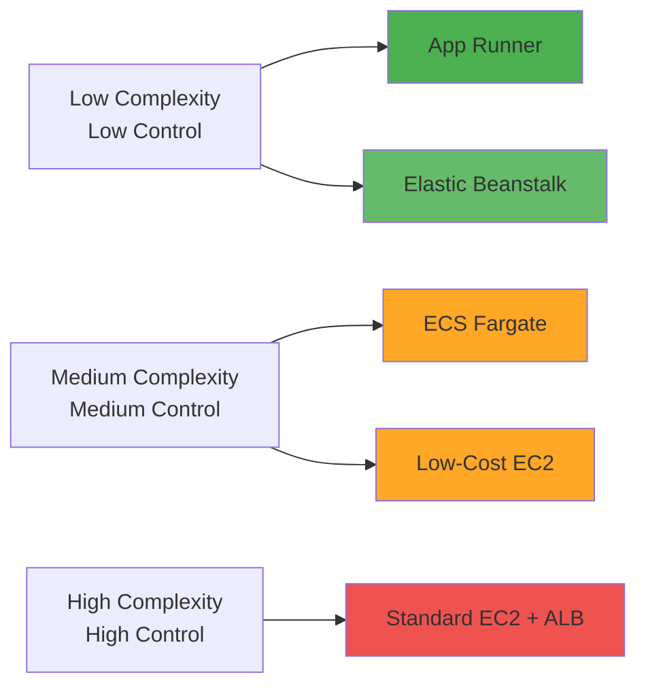

The journey from local development to cloud deployment is rarely straightforward. Which AWS service should you choose? How much will it cost? What trade-offs are you making? In this final evolution of the Tenant Management project, we deployed our full-stack application (Spring Boot + React + PostgreSQL) using **5 different AWS deployment approaches**, documenting the architecture, costs, and learnings from each.

> **Evolution Context**: This post is part of [Evolution 6: Cloud Deployment Strategies](/projects/tenant-management/evolution-6/) in the [Tenant Management Evolutionary Project](/projects/tenant-management/). This evolution focuses on cloud infrastructure and deployment strategies, building upon the conversational interface established in [Evolution 5](/projects/tenant-management/evolution-5/).

> **Requirements Context**: This iteration fulfills the deployment and infrastructure goals from [Landlord-Tenant Management System: Requirements and Objectives](/learning/requirements/analysis/tenant-management-requirements/) by exploring multiple production-ready deployment strategies with comprehensive cost analysis.

## The Deployment Challenge

Our Tenant Management application is a modern full-stack system:

- **Backend**: Java 21 with Spring Boot 3.3.4
- **Frontend**: React 18 with Tailwind CSS  
- **Database**: PostgreSQL 16
- **AI Integration**: Google Gemini 2.5 Flash for intelligent features

The question: **How do we deploy this to AWS?** And more importantly, **which approach is right for different scenarios?**

## The 5 Deployment Approaches

We experimented with 5 distinct AWS deployment strategies, each with different cost profiles, complexity levels, and use cases:

| Approach | Monthly Cost | Complexity | Best For | Status |
|----------|-------------|------------|----------|--------|
| **1. Low-Cost EC2 + Spot** | ~$10-13 | Medium | Dev/Testing, Demos | ✅ Complete |
| **2. AWS Elastic Beanstalk** | ~$100+ | Low | Quick Production Deploy | ✅ Complete |
| **3. AWS App Runner** | ~$50-80 | Very Low | Serverless Containers | ✅ Complete |
| **4. AWS ECS (Fargate)** | ~$70-120 | Medium-High | Production Microservices | ✅ Complete |
| **5. Standard EC2 + ALB** | ~$80-100 | High | Full Control, HA Setup | ✅ Complete |

Let's dive deep into each approach.

---

## Approach 1: Low-Cost EC2 with Spot Instances

**Monthly Cost**: ~$10-13 | **Branch**: `feature/aws-lowcost-deployment`

### Architecture Overview

This approach consolidates the entire stack onto a **single EC2 Spot instance**, eliminating expensive managed services like RDS, ALB, and NAT Gateways.

### Key Components

- **Single EC2 Spot Instance**: t3.small Spot instance (70-90% cheaper than On-Demand)
- **Containerized Database**: PostgreSQL 16 runs as a Docker container
- **Docker Compose**: Orchestrates all services (db, api, frontend)
- **Public Subnet**: Direct internet access with Security Groups
- **CloudWatch Logs**: All container logs stream to `/app/lowcost-env`

### Cost Breakdown

| Component | Specification | Monthly Cost |
|-----------|--------------|--------------|
| Compute (Spot) | EC2 t3.small Spot | ~$2-5 |
| Storage | EBS gp3 30GB | ~$2.40 |
| Database | Self-hosted PostgreSQL | $0 |
| Networking | Public IP + Data Transfer | ~$1-3 |
| CI/CD | CodePipeline + CodeBuild | ~$2-3 |
| **Total** | | **~$10-13** |

### Pros & Cons

**✅ Pros:**
- **Extremely Cost-Effective**: 80-90% cheaper than managed services
- **Simple Architecture**: Everything on one instance
- **Full CI/CD**: Automated deployments via CodePipeline
- **CloudWatch Integration**: Comprehensive logging and monitoring

**❌ Cons:**
- **Spot Interruptions**: Instance can be terminated (though rare for t3.small)
- **No High Availability**: Single point of failure
- **Manual Management**: Database backups and Docker management are user responsibilities
- **Not Production-Ready**: Lacks redundancy

### Best Use Cases

**Ideal for:**
- Development and testing environments
- Proof of concepts (POCs)
- Demos and presentations
- Learning and experimentation
- Personal projects with low traffic

**Not recommended for:**
- Production workloads requiring high availability
- Applications with strict uptime SLAs
- High-traffic applications

### Key Learnings

1. **Spot Instances are Reliable**: For t3.small, interruptions are rare. Persistent requests ensure automatic recovery.
2. **Containerized DB is Viable**: For dev/test, running PostgreSQL in Docker saves significant cost with minimal trade-offs.
3. **Ubuntu vs Amazon Linux**: Ubuntu 24.04 provides better Docker support and package management.
4. **CloudWatch Logging**: Essential for debugging containerized applications without SSH access.

---

## Approach 2: AWS Elastic Beanstalk

**Monthly Cost**: ~$100+ | **Branch**: `feature/aws-beanstalk-deployment`

### Architecture Overview

Elastic Beanstalk provides a **Platform-as-a-Service (PaaS)** solution that automatically handles deployment, capacity provisioning, load balancing, and auto-scaling.

### Key Components

- **VPC**: `beanstalk-env-vpc` with public and private subnets
- **Elastic Beanstalk Environment**: Docker platform on Amazon Linux 2023
- **Auto Scaling**: Automatically provisions and manages EC2 instances
- **Application Load Balancer**: Distributes traffic across instances
- **RDS PostgreSQL**: Managed database (db.t4g.micro) in private subnet
- **NAT Gateway**: Enables outbound internet access for private subnets

### Cost Breakdown

| Component | Specification | Monthly Cost |
|-----------|--------------|--------------|
| EC2 Instances | t3.micro (min 1, max 2) | ~$15-30 |
| Application Load Balancer | ALB with health checks | ~$23 |
| RDS PostgreSQL | db.t4g.micro, 20GB | ~$18 |
| NAT Gateway | Data processing + hours | ~$35-45 |
| EBS Storage | gp3 volumes | ~$5 |
| Data Transfer | Outbound traffic | ~$5-10 |
| **Total** | | **~$100+** |

### Pros & Cons

**✅ Pros:**
- **Managed Infrastructure**: Beanstalk handles provisioning, scaling, monitoring
- **Auto Scaling**: Automatically adjusts capacity based on load
- **Zero-Downtime Deployments**: Rolling updates with health checks
- **Easy Rollbacks**: One-click deployment history
- **Integrated Monitoring**: CloudWatch metrics and logs

**❌ Cons:**
- **Higher Cost**: ALB and NAT Gateway add significant expense
- **Less Control**: Platform abstractions limit customization
- **Platform Lock-in**: Beanstalk-specific configuration
- **Complexity for Simple Apps**: Overkill for small projects

### Best Use Cases

**Ideal for:**
- Production applications requiring high availability
- Teams wanting managed infrastructure
- Applications with variable traffic (auto-scaling)
- Quick production deployments

### Key Learnings

1. **Platform Abstraction**: Beanstalk simplifies deployment but adds cost and reduces flexibility
2. **Docker Compose Support**: Multi-container apps work well with Beanstalk's Docker platform
3. **Environment Configuration**: Proper environment variable management is crucial
4. **Health Checks**: Beanstalk's health monitoring requires proper endpoint configuration

---

## Approach 3: AWS App Runner

**Monthly Cost**: ~$50-80 | **Branch**: `feature/aws-apprunner-deployment`

### Architecture Overview

AWS App Runner is a **fully managed serverless container service** that automatically builds, deploys, and scales containerized web applications.

### Key Components

- **VPC**: `apprunner-demo-vpc` with VPC Connector
- **App Runner Services**: Separate services for Backend and Frontend
- **VPC Connector**: Bridges App Runner to private subnets
- **RDS PostgreSQL**: Managed database (db.t4g.micro) in private subnet
- **Auto-Deploy**: Triggers on new ECR image push

### Cost Breakdown

| Component | Specification | Monthly Cost |
|-----------|--------------|--------------|
| App Runner (Backend) | 1 vCPU, 2GB RAM | ~$25 |
| App Runner (Frontend) | 1 vCPU, 2GB RAM | ~$25 |
| RDS PostgreSQL | db.t4g.micro, 20GB | ~$18 |
| NAT Gateway | For VPC Connector | ~$35 |
| Data Transfer | Outbound traffic | ~$5 |
| **Total** | | **~$50-80** |

### Pros & Cons

**✅ Pros:**
- **Fully Managed**: Zero infrastructure management
- **Auto-Scaling**: Scales based on traffic automatically
- **Simple Deployment**: Just push to ECR
- **HTTPS by Default**: Automatic SSL/TLS certificates
- **Pay-per-Use**: Only pay for compute time used

**❌ Cons:**
- **Cold Starts**: Initial requests may be slow after idle period
- **Limited Customization**: Less control over infrastructure
- **VPC Connector Costs**: NAT Gateway still required for private resources
- **Regional Availability**: Not available in all AWS regions
- **Container Size Limits**: Image size and memory constraints

### Best Use Cases

**Ideal for:**
- Microservices architectures
- API backends with variable traffic
- Containerized web applications
- Teams wanting zero infrastructure management
- Development and staging environments

### Key Learnings

1. **VPC Connector is Essential**: Required for accessing private RDS instances
2. **Auto-Deploy Feature**: Simplifies CI/CD - just push to ECR
3. **Service-to-Service Communication**: Use public URLs or configure private networking
4. **Cost Optimization**: Pause services when not needed to save costs

---

## Approach 4: AWS ECS Fargate

**Monthly Cost**: ~$70-120 | **Branch**: `feature/aws-ecs-deployment`

### Architecture Overview

AWS ECS (Elastic Container Service) with Fargate provides a **serverless container orchestration platform**. Unlike EC2-based deployments, Fargate eliminates the need to manage servers.

### Key Components

- **VPC**: `vpc-ecs-demo` (10.0.0.0/16) with public and private subnets
- **ECS Fargate**: Serverless container engine
  - Frontend Service: React application with Nginx
  - Backend Service: Spring Boot API
- **Application Load Balancer**: Path-based routing to services
- **RDS PostgreSQL**: Managed database with automated backups
- **AWS Cloud Map**: Service discovery for container-to-container communication
- **Container Insights**: Detailed metrics and monitoring

### Cost Breakdown

| Component | Specification | Monthly Cost |
|-----------|--------------|--------------|
| ECS Fargate (Backend) | 0.5 vCPU, 1GB RAM | ~$25-35 |
| ECS Fargate (Frontend) | 0.25 vCPU, 0.5GB RAM | ~$15-20 |
| Application Load Balancer | ALB with health checks | ~$23 |
| RDS PostgreSQL | db.t4g.micro, 20GB | ~$18 |
| NAT Gateway | Data processing + hours | ~$35-45 |
| CloudWatch Logs | Log storage | ~$3-5 |
| **Total** | | **~$70-120** |

### Pros & Cons

**✅ Pros:**
- **No Server Management**: Fargate handles all infrastructure
- **Auto-Scaling**: Scales containers based on demand
- **High Availability**: Multi-AZ deployment support
- **Security**: Containers in private subnets, isolated networking
- **Container Insights**: Detailed performance metrics
- **Rolling Updates**: Zero-downtime deployments

**❌ Cons:**
- **Higher Cost**: 20-30% more expensive than EC2 launch type
- **NAT Gateway Costs**: Required for outbound internet access
- **Complexity**: Requires understanding of ECS concepts (tasks, services, clusters)
- **Cold Start**: Initial container startup time

### Best Use Cases

**Ideal for:**
- Production microservices architectures
- Applications requiring high availability
- Teams wanting serverless container orchestration
- Scalable web applications
- Environments with variable traffic patterns

### Key Learnings

1. **Service Discovery**: AWS Cloud Map enables seamless container-to-container communication
2. **Security Groups**: Layered security (ALB → ECS → RDS) provides defense in depth
3. **Rolling Updates**: Health checks are essential for zero-downtime deployments
4. **Fargate vs EC2**: Fargate trades ~20-30% higher cost for complete operational simplicity
5. **Container Insights**: Essential for production workloads—provides invaluable visibility

---

## Approach 5: Standard EC2 with Auto Scaling

**Monthly Cost**: ~$80-100 | **Branch**: `feature/aws-ec2-deployment`

### Architecture Overview

This approach uses **traditional EC2 instances** managed by an Auto Scaling Group, fronted by an Application Load Balancer. It provides **maximum control** over infrastructure.

### Key Components

- **VPC**: `vpc-ec2-demo` with public and private subnets
- **Auto Scaling Group**: Manages EC2 instances (t3.micro, min 1, max 2)
- **Launch Template**: Defines instance configuration
- **Nginx**: Reverse proxy on each EC2 instance
  - Port 80: Routes to Frontend (React static files)
  - Port 8080: Proxies to Backend (Spring Boot)
- **Application Load Balancer**: Distributes traffic across instances
- **RDS PostgreSQL**: Managed database in private subnet
- **CodeDeploy**: Deploys to EC2 instances with lifecycle hooks

### Cost Breakdown

| Component | Specification | Monthly Cost |
|-----------|--------------|--------------|
| EC2 Instances | t3.micro (min 1, max 2) | ~$15-30 |
| Application Load Balancer | ALB with health checks | ~$23 |
| RDS PostgreSQL | db.t4g.micro, 20GB | ~$18 |
| NAT Gateway | Data processing + hours | ~$35-45 |
| EBS Storage | gp3 volumes | ~$5 |
| Data Transfer | Outbound traffic | ~$5 |
| **Total** | | **~$80-100** |

### Pros & Cons

**✅ Pros:**
- **Full Control**: Complete control over instance configuration
- **High Availability**: Auto Scaling Group ensures redundancy
- **Flexible Scaling**: CPU-based auto-scaling policies
- **Traditional Deployment**: Familiar deployment patterns
- **SSM Session Manager**: Secure access without SSH keys
- **CloudWatch Integration**: Comprehensive logging and monitoring

**❌ Cons:**
- **Higher Operational Overhead**: Manual instance management
- **Patching Responsibility**: OS and security updates are user-managed
- **Complexity**: More moving parts to configure and maintain
- **NAT Gateway Costs**: Significant expense for outbound traffic

### Best Use Cases

**Ideal for:**
- Production applications requiring full control
- Traditional deployment workflows
- High-availability setups
- Teams comfortable with EC2 management
- Applications with predictable traffic patterns

### Key Learnings

1. **CodeDeploy Lifecycle Hooks**: Essential for graceful deployments and health validation
2. **Nginx as Reverse Proxy**: Simplifies routing and SSL termination
3. **Instance Warm-up**: New instances need time to download dependencies—configure appropriate grace periods
4. **CloudWatch Agent**: Essential for streaming logs from EC2 to CloudWatch
5. **SSM Session Manager**: Eliminates need for SSH key management and provides audit trail

---

## Comprehensive Comparison

### Cost Comparison Matrix

| Approach | Monthly Cost | Cost per Hour | Best Value For |
|----------|-------------|---------------|----------------|
| Low-Cost EC2 + Spot | $10-13 | ~$0.014 | Dev/Testing |
| App Runner | $50-80 | ~$0.069 | Serverless Simplicity |
| ECS Fargate | $70-120 | ~$0.097 | Production Microservices |
| Standard EC2 + ALB | $80-100 | ~$0.111 | Full Control |
| Elastic Beanstalk | $100+ | ~$0.139 | Managed Production |

### Complexity vs Control

### Decision Matrix

| Scenario | Recommended Approach | Why |
|----------|---------------------|-----|
| **Development/Testing** | Low-Cost EC2 + Spot | Minimal cost, full functionality |
| **Quick Production Deploy** | Elastic Beanstalk | Managed infrastructure, auto-scaling |
| **Serverless Preference** | App Runner | Zero infrastructure management |
| **Microservices Architecture** | ECS Fargate | Container orchestration, scalability |
| **Maximum Control** | Standard EC2 + ALB | Full customization, traditional patterns |
| **Cost-Conscious Production** | App Runner or ECS Fargate | Balance of cost and features |
| **High-Traffic Production** | ECS Fargate or EC2 + ALB | Proven scalability, reliability |

---

## Common Architecture Components

All deployment approaches share these core components:

- **VPC**: Isolated network with public and private subnets
- **RDS PostgreSQL**: Managed database in private subnet (except Low-Cost)
- **Security Groups**: Layered security controls
- **CloudWatch**: Logging and monitoring
- **CI/CD Pipeline**: CodePipeline + CodeBuild for automated deployments
- **Terraform**: Infrastructure as Code for reproducibility

---

## Key Takeaways

### 1. **There's No One-Size-Fits-All Solution**

Each deployment approach has distinct trade-offs. The "best" choice depends on:
- Budget constraints
- Operational expertise
- Scalability requirements
- High availability needs
- Control vs convenience preferences

### 2. **Cost Optimization Requires Trade-offs**

- **Low-Cost EC2**: Sacrifices high availability for 80-90% cost savings
- **Managed Services**: Pay premium for operational simplicity
- **NAT Gateway**: Single biggest cost driver in most architectures (~$35-45/month)

### 3. **Serverless Isn't Always Cheaper**

- App Runner and ECS Fargate offer operational simplicity but cost more than optimized EC2
- For consistent workloads, EC2 Reserved Instances can be more cost-effective
- Serverless shines for variable traffic patterns

### 4. **Infrastructure as Code is Essential**

All approaches use **Terraform** for:
- Reproducibility across environments
- Version control of infrastructure
- Easy teardown and recreation
- Documentation through code

### 5. **Monitoring and Logging are Non-Negotiable**

CloudWatch integration across all approaches enables:
- Debugging without SSH access
- Performance monitoring
- Cost tracking
- Security auditing

### 6. **CI/CD Automation Pays Off**

Automated pipelines (CodePipeline + CodeBuild) provide:
- Consistent deployments
- Reduced human error
- Faster iteration cycles
- Rollback capabilities

---

## Evolution Complete: Lessons Learned

This final evolution of the Tenant Management project represents a comprehensive exploration of AWS deployment strategies. From a $10/month development environment to enterprise-grade production deployments, we've documented the full spectrum of possibilities.

### The Journey So Far

- **Evolution 1**: Single-file Python application
- **Evolution 2**: Modular monolith with React
- **Evolution 3**: Enterprise Java stack with Spring Boot
- **Evolution 4**: AI integration with MCP and LLM APIs
- **Evolution 5**: Conversational interface with chat UX
- **Evolution 6**: Cloud deployment across 5 AWS approaches ✅

### What We've Learned

1. **Architecture Evolution**: From single-file to cloud-native microservices
2. **Technology Mastery**: Python, Java, React, Docker, Kubernetes concepts, AWS services
3. **Cost Awareness**: Understanding the financial implications of architectural decisions
4. **Deployment Strategies**: Hands-on experience with 5 different AWS deployment patterns
5. **Trade-off Analysis**: No perfect solution—only informed decisions based on requirements

### Real-World Application

These experiments provide a **decision-making framework** for future projects:

- **Prototypes/Demos**: Low-Cost EC2 + Spot
- **Startups/MVPs**: App Runner (simplicity) or Low-Cost EC2 (budget)
- **Growing Applications**: Elastic Beanstalk (managed) or ECS Fargate (scalability)
- **Enterprise Applications**: ECS Fargate (microservices) or EC2 + ALB (control)

---

## Future Experiments

While this evolution is complete, the learning continues:

- ☐ **Google Cloud Platform (GCP)** deployments
- ☐ **Kubernetes (EKS/GKE)** orchestration
- ☐ **Multi-cloud comparison** (AWS vs GCP vs Azure)
- ☐ **Cost optimization** deep dive
- ☐ **Performance benchmarking** across approaches

---

## Resources

All code, Terraform configurations, and deployment scripts are available in the GitHub repository:

- **Repository**: [tenant-management-java-app](https://github.com/javiator/tenant-management-java-app)
- **Branches**:
  - `feature/aws-lowcost-deployment`
  - `feature/aws-beanstalk-deployment`
  - `feature/aws-apprunner-deployment`
  - `feature/aws-ecs-deployment`
  - `feature/aws-ec2-deployment`

### Architecture Diagrams

- [Low-Cost Architecture](/assets/images/tenant-management/cloud-deployment/lowcost_architecture.png)
- [Elastic Beanstalk Architecture](/assets/images/tenant-management/cloud-deployment/beanstalk_architecture.png)
- [App Runner Architecture](/assets/images/tenant-management/cloud-deployment/apprunner_architecture.png)
- [ECS Fargate Architecture](/assets/images/tenant-management/cloud-deployment/ecs_fargate_architecture.png)
- [EC2 Auto Scaling Architecture](/assets/images/tenant-management/cloud-deployment/ec2_autoscaling_architecture.png)

---

## Conclusion

Deploying a full-stack application to AWS is not a simple "click and deploy" process—it requires understanding trade-offs, costs, and operational implications. By experimenting with 5 different approaches, we've gained invaluable insights into:

- **Cost structures** of different AWS services
- **Operational complexity** of managed vs self-managed infrastructure
- **Scalability patterns** for different traffic profiles
- **Security best practices** across deployment models
- **CI/CD automation** for consistent deployments

This knowledge empowers informed decision-making for future projects, ensuring we choose the right deployment strategy based on requirements, not assumptions.

The Tenant Management evolutionary project is now complete, having progressed from a single Python file to a cloud-deployed, AI-enhanced, production-ready application with comprehensive deployment options. The journey has been transformative, and the learnings will inform every future architectural decision.

**Thank you for following this evolution!** 🚀



