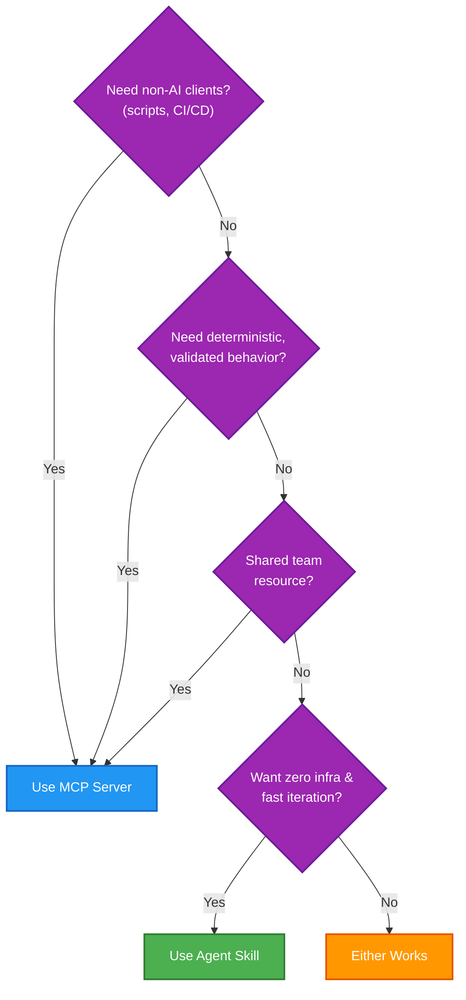

The landscape of AI agents is evolving from simple chat interfaces to autonomous systems that can *do* things—browse the web, manage infrastructure, or interact with proprietary APIs. But as we build these systems, a fundamental architectural question arises: **How should we connect our agents to the tools they need?**

Until recently, the **Model Context Protocol (MCP)** was the de facto standard. Now, **Agent Skills** (originally introduced as Claude Skills) offer a compelling alternative. 

This post explores the trade-offs between these two approaches and provides a practical guide on when to use which.

## What is it?

### Model Context Protocol (MCP)
MCP is a standardized protocol that allows AI models to connect to external data sources and tools through a "server" process. Think of it as a **Microservice API** for LLMs. It defines a rigid contract: the server tells the LLM exactly what tools it has, what parameters they take, and how to call them.

### Agent Skills
A "Skill" is essentially a technical "runbook" or playbook for an AI. Instead of a standalone server process, a skill is a structured markdown file (often with supporting scripts) that teaches the model how to perform a specific task. While they gained popularity as a platform-specific feature, they are now part of the **Agent Skills open standard**, making them cross-platform.

## How it Works: The Architecture Shift

The fundamental difference lies in where the "intelligence" of the tool resides.

*   **MCP** relies on a **Connectivity Layer**. You write code (Python, Go, Node.js) to build a server that acts as a proxy between the LLM and your API.
*   **Skills** rely on a **Procedural Knowledge Layer**. You provide instructions and perhaps a small script, and the LLM "learns" how to use the underlying systems directly.

### The "Thin Proxy" Case
A common pattern in agent development is creating an MCP server that is just a "thin proxy"—it takes a tool call and translates it into a REST API call. In these cases, a **Skill** can often replace the entire MCP server. 

Instead of deploying and maintaining a Python server just to call `curl`, you can simply give the agent a Skill that says: *"When you need to list tenants, run this curl command with these headers."*

## Why Does it Matter?

### The Token Efficiency Gap
One major advantage of Skills is **progressive disclosure** (lazy-loading). 
*   **MCP**: Historically, all tool schemas were loaded into the context window at startup, which could be heavy on tokens.
*   **Skills**: Only the high-level descriptions are loaded initially (~100 tokens). The full instructions and scripts are only pulled into context when the agent decides it actually needs them.

### Determinism vs. Flexibility
*   **MCP** offers **Hard Validation**. Tools use Pydantic or similar libraries to reject bad input before it ever touches your backend. It is deterministic: same input, same tool call.
*   **Skills** offer **Human-Like Judgment**. They can encode business rules that are hard to express in a JSON schema, like *"Always check if a tenant exists before creating a transaction."* However, they are probabilistic—the LLM interprets the instructions, which can occasionally lead to variation.

## Side-by-Side Comparison

| Dimension | MCP Server | Agent Skill |
| :--- | :--- | :--- |
| **Setup Effort** | High (Server, Dependencies, Deploy) | Low (Markdown file, maybe a script) |
| **Maintenance** | Code changes + CI/CD + Redeploy | Edit a text file |
| **Client Support** | Universal (Any MCP-compatible client) | Cross-platform (Open standard) |
| **Reliability** | Deterministic, Validated | Probabilistic (Instruction-based) |
| **Auth** | Built-in (OAuth, Refresh tokens) | Environment Variables / Scripts |
| **Token Cost** | Higher (Loaded upfront) | Lower (Lazy-loaded) |

## The Decision Logic

When should you choose one over the other? Use this flowchart to help decide:



## Real-World Example: Tenant Management API

Let's see how the same functionality looks in both approaches. Suppose you want to give your agent the ability to list tenants from a REST API.

### The MCP Approach

**Server Code (Python):**
```python
from mcp.server import Server
from pydantic import BaseModel
import httpx

class ListTenantsParams(BaseModel):
    limit: int = 10

@server.tool()
async def list_tenants(params: ListTenantsParams):
    """List all tenants from the API"""
    async with httpx.AsyncClient() as client:
        response = await client.get(
            f"{BASE_URL}/api/tenants",
            headers={"Authorization": f"Bearer {API_TOKEN}"},
            params={"limit": params.limit}
        )
        response.raise_for_status()
        return response.json()["data"]
```

**What the Agent Sees:**
```json
{
  "name": "list_tenants",
  "description": "List all tenants from the API",
  "parameters": {
    "limit": {"type": "integer", "default": 10}
  }
}
```

### The Agent Skill Approach

**Skill File (`.agent/skills/tenant-management/SKILL.md`):**
```markdown
---
name: tenant-management
description: Manage tenants via REST API
allowed-tools:
  - Bash(.claude/skills/tenant-management/scripts/tm-api.sh *)
---

# Tenant Management API Skill

Use the `tm-api.sh` script for all API operations. The script handles authentication, input validation, and formatting.

## Commands

| Command | Usage |
|---|---|
| List all | `tm-api.sh list-tenants` |
| Create | `tm-api.sh create-tenant '<json>'` |
```

**What the Agent Does:**
The agent reads the skill and simply calls the script:
```bash
tm-api.sh list-tenants
```
The script handles the `curl` construction, auth tokens, and JSON parsing internally. This is cleaner, safer, and uses fewer tokens than documenting raw `curl` commands.

### Key Differences in Practice

| Aspect | MCP Example | Skill Example |
| :--- | :--- | :--- |
| **Lines of Code** | ~20 lines Python | ~15 lines Markdown |
| **Deployment** | Deploy server, manage process | Copy file to `.agent/skills/` |
| **Update Process** | Code change → Test → Deploy | Edit markdown → Save |
| **Validation** | Pydantic rejects `limit: "abc"` | Backend returns 400 error |
| **Debugging** | Server logs, structured errors | Read curl output |


## Conclusion: Better Together

It doesn't have to be an "either/or" decision. In many advanced architectures, the best approach is a layered one:

1.  **MCP** for the **Connectivity Layer**: Use it to provide reliable, authenticated, and validated access to your core APIs.
2.  **Skills** for the **Knowledge Layer**: Use them to teach the agent the "business logic" of how to use those MCP tools intelligently.

For example, an MCP server provides a `list_transactions` tool. A Skill then teaches the agent: *"When checking balances, call list_transactions, subtract 'payment_received' from the total, and present the result in a table."*

By combining the **reliability of MCP** with the **procedural intelligence of Skills**, you can build agents that are both robust and genuinely smart.

---

> **Tip**: If you are just starting to prototype an integration, start with a **Skill**. It’s zero-infrastructure and lets you iterate on the "how" before you commit to the "infrastructure" of an MCP server.
