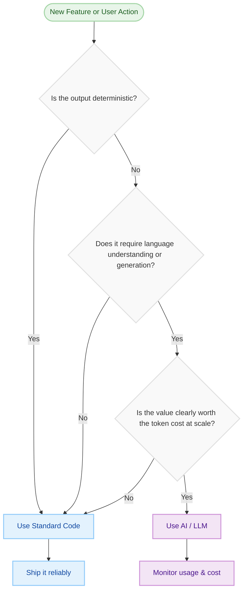
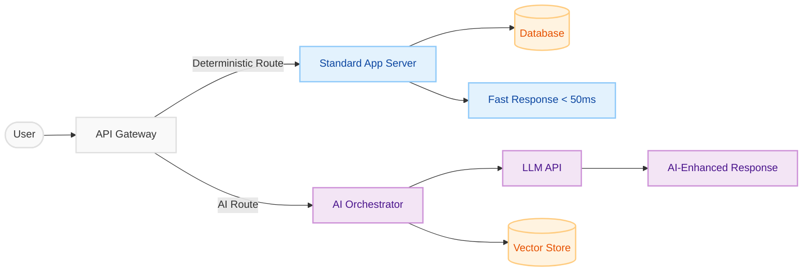

Here's a question that should be on every engineering leader's mind right now: **are we using AI where it truly adds value, or just because we can?**

The pressure to "add AI" to products is enormous. Investors want it. Marketing loves it. But for engineers and architects scaling systems to tens of millions of users, indiscriminate AI adoption is a fast road to runaway costs, unpredictable behaviour, and a frustrating user experience.

This is not an argument against AI. It is an argument *for* using AI with intention. The most mature engineering teams aren't asking "where can we use AI?" — they're asking "where can we *not* get away without it?"

*The Scaling Trap: Facing an exponential API bill caused by indiscriminate 'AI sprawl' into deterministic workflows.*

---

## The Enterprise Cost Trap: When AI Scales Against You

To understand the problem, let's look at how costs actually behave.

A single GPT-5-class model API call might cost around $0.01–$0.03. That sounds negligible. But consider a platform with 500,000 daily active users and an application that routes every user action through an LLM:

| Daily Active Users | AI Calls per User | Cost per Call | **Daily Cost** | **Monthly Cost** |
|:-:|:-:|:-:|:-:|:-:|
| 10,000 | 5 | $0.02 | $1,000 | **$30,000** |
| 100,000 | 5 | $0.02 | $10,000 | **$300,000** |
| 500,000 | 5 | $0.02 | $50,000 | **$1,500,000** |

And this is before accounting for conversational memory (which inflates context window size), Retrieval-Augmented Generation (RAG) pipelines, and embedding costs. In practice, it gets significantly worse.

*Unplanned AI costs scale exponentially compared to the linear costs of standard code.*

> **The key insight:** Many of these AI calls are for tasks that could be resolved with a single database lookup or a few lines of deterministic logic.

Here is what over-reliance on AI actually costs beyond the invoice:

1. **Token Explosions & Cloud Bills** — Every request through an LLM carries a full context packet. As features grow and memory is added, token counts per request balloon rapidly. 
2. **The Latency Tax** — LLMs inherently take 1–5 seconds to respond. Wiring them into core navigation, form submissions, or data lookups introduces frustrating delays that kill conversion rates.
3. **Unpredictability in Defined Workflows** — If a task has a single correct answer (date parsing, order status, permission checks), a probabilistic model is the wrong tool. Edge cases will surface as hallucinations that erode user trust.
4. **Environmental Impact** — Training and serving large models is energy-intensive. Using them for tasks a simple SQL query could handle is simply irresponsible at scale.

---

## The Solution: A Hybrid Architecture

The answer is not to avoid AI — it is to architect your system so that AI handles only what it is uniquely good at, and standard code handles everything else.

*A clean split: deterministic logic stays in standard code; intelligent, generative tasks go to the AI brain.*

Think of your application as a well-built car. The engine, brakes, and chassis are your **standard code** — dependable, precise, and predictable. The smart navigation, voice assistant, and adaptive cruise control are your **AI layer** — useful, context-aware enhancements that you'd never use to press the accelerator.

*Standard code provides the core chassis and engine; AI provides the intelligent edge.*

### Standard Code — The Reliable Spine

Use traditional application logic for everything that has a predictable, defined output:

- Authentication, authorisation, and permission checks
- Form validation and data formatting
- Core routing and navigation flows
- Paginated data fetching and CRUD operations
- Rule-based notifications and alerting
- Pricing calculations, date handling, and business logic

**What you get:** Sub-millisecond responses, zero hallucination risk, and a cost that doesn't scale with your user base.

### The AI Brain — The Intelligent Edge

Reserve your LLM calls for tasks where human-like reasoning and language understanding genuinely move the needle:

- Natural language search and intent understanding
- Personalised recommendations based on nuanced user context
- Summarising or synthesising large volumes of unstructured data
- Generating dynamic, context-aware content
- Intelligent triage and routing of support tickets
- Conversational interfaces and AI assistants

**What you get:** Experiences that feel magical — because they are only shown where they matter.

---

## A Decision Framework: Should This Be AI or Code?

Before building any feature, run it through this simple decision flow:

Apply this decision process at feature-design time, not after you've already wired everything to an LLM.

---

## Real-World Examples

Here is how this thinking plays out in practice across common product domains:

| Feature | Approach | Why |
|---|---|---|
| User login & auth | Standard Code | Binary correct/incorrect — zero room for ambiguity |
| Search bar autocomplete | Standard Code | Index-based prefix match is fast, cheap, and accurate |
| Semantic product search | AI | Understanding intent ("something warm for winter") requires NLP |
| Showing order status | Standard Code | Deterministic database lookup |
| Summarising a customer's order history | AI | Requires language synthesis and contextual understanding |
| Calculating a discount | Standard Code | Pure arithmetic — hallucination risk is unacceptable |
| Recommending products a user will love | AI | Personalisation requires reasoning over nuanced user signals |
| Routing a support ticket | AI | Categorising free-text messages benefits from NLP |
| Sending a shipping confirmation email | Standard Code | Template rendering — deterministic by design |

---

## The Hybrid Architecture in Practice

The architecture that achieves this balance routes requests intelligently from the moment they arrive:

The critical component here is the **AI Orchestrator** — a lightweight routing layer (not another LLM!) that decides based on request type, flags, or metadata whether a request needs the AI path at all. This layer can also enforce rate limiting, token budgets, and fallback logic.

---

## Building the Right Culture

This is ultimately an organisational challenge as much as a technical one. Teams should:

- **Audit every AI touchpoint** — Is each one pulling its weight? Track token usage per feature.
- **Set token budgets per user or per session** — Treat AI calls like database queries: finite and budgeted resources.
- **Design for graceful degradation** — If the AI is unavailable or slow, what does your standard code fallback look like?
- **Separate concerns clearly in your codebase** — Business logic should live in your application, not buried inside an LLM prompt.

---

## Conclusion: The Right Brain for the Right Job

The measure of a well-engineered AI product is not how much AI it uses — it is how *well-placed* every AI touchpoint is. Users should feel the intelligence exactly where it delights and assists them, and feel the smooth reliability of a traditional application everywhere else.

By treating AI as a precision instrument rather than a universal hammer, you build products that are:

- **Financially sustainable** — costs grow linearly with business value, not exponentially with user count
- **Consistently reliable** — core flows are rock-solid and fast, always
- **Environmentally responsible** — compute is used purposefully, not frivolously

The most sophisticated agentic systems aren't the ones powered entirely by LLMs. They're the ones that know exactly when to hand off to one.
